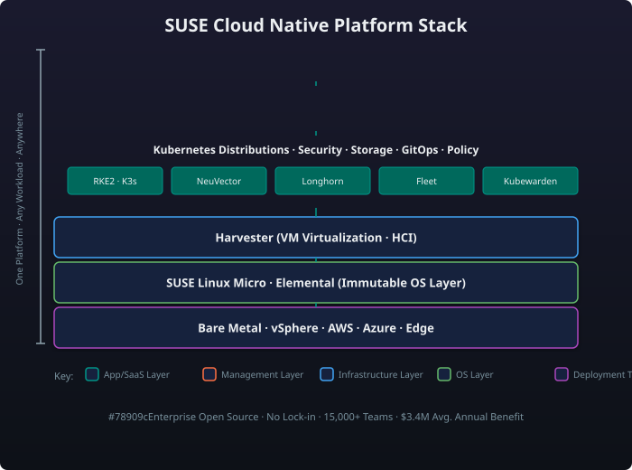

# Module 1: SUSE Strategy & Platform Overview

!!! info "Module Purpose"
    Understand why SUSE is positioned as the enterprise open source leader in cloud native infrastructure, how the platform is architected, and what key innovations were unveiled at SUSECON 2025.

---

## The Core Narrative

SUSE is the **enterprise open source cloud native leader** — the only vendor delivering a complete, integrated stack of Kubernetes distributions, multi-cluster management, container security, VM virtualization, edge computing, storage, GitOps, and policy-as-code, all built on 100% open source foundations with an enterprise-grade support and subscription model.

Unlike proprietary alternatives (VMware Tanzu, Red Hat OpenShift, Google GKE, AWS EKS) that lock customers into walled gardens or single-cloud ecosystems, SUSE delivers **portability, choice, and compliance** without vendor lock-in. Every component in the stack is upstream-tested, FIPS-ready, CIS-benchmarked, and backed by a single SLA — all the way from the data center to the remote edge.

> **Key message:** "One stack, any cluster, any cloud, any edge — open source at every layer, enterprise SLAs end-to-end."

---

## The Platform Story

SUSE's cloud native platform is designed as a layered stack. Each layer can operate independently or as part of the integrated whole.

### Layered Platform Stack

### The SUSE Difference

| Dimension | SUSE | VMware Tanzu | Red Hat OpenShift | Cloud Providers |
|-----------|------|---------------|-------------------|-----------------|
| **Licensing** | 100% open source | Mixed (proprietary add-ons) | Core upstream + proprietary tooling | Proprietary managed services |
| **Portability** | Run anywhere | vSphere-tethered | Tight OpenShift ecosystem | Cloud-locked (EKS, AKS, GKE) |
| **Edge-first** | K3s (<100 MB, SQLite) | Heavyweight | OpenShift (1.5 GB+) | Cloud-only or edge-limited |
| **Security** | NeuVector (CNAPP), Kubewarden | vDefend (limited) | ACS (Red Hat) | Cloud-native SIEM per provider |
| **VM + Containers** | Harvester (KubeVirt) | vSphere (proprietary) | OpenShift Virtualization | No native VM support |
| **Support model** | Single SLA, full stack | Split SKUs | Multi-subscription | Per-service support |

---

## Market Position & Business Impact

SUSE's cloud native portfolio has strong, verifiable market traction:

| Metric | Data | Source / Context |
|--------|------|------------------|
| **Enterprise teams** | 15,000+ | Active customer teams using SUSE CN products |
| **IDC study value** | $3.4M | IDC Business Value study — 3-year ROI for SUSE CN stack |
| **SAP validation** | SAP-certified | RKE2 & K3s certified for SAP S/4HANA & BTP workloads |
| **Temenos certified** | Temenos verified | RKE2 passes Temenos banking platform certification |
| **Kubewarden policies** | 200+ | Published in the official policy hub |
| **NeuVector CVEs** | 10,000+/day | Real-time threat feed coverage |
| **Longhorn downloads** | 50M+ | Container image pulls |

!!! quote "The $3.4M IDC Business Value Finding"
    > Organisations deploying SUSE's cloud native stack realised an average **$3.4M in annual business value** over three years, including:
    >
    > - 66% faster application deployment cycles
    > - 60% reduction in unplanned downtime
    > - 45% lower infrastructure costs
    > - 30% improvement in developer productivity
    >
    > *Source: IDC Business Value Snapshot, commissioned by SUSE (2024)*

---

## Key Innovations — SUSECON 2025

At SUSECON 2025 (Berlin, June 2025), SUSE announced a wave of platform innovations:

| Category | Innovation | Description |
|----------|-----------|-------------|
| **Kubernetes** | **RKE2 v1.32** | Latest upstream K8s, improved etcd backup/restore, faster cluster bootstrap |
| **Kubernetes** | **K3s v1.32 + K3s IoT** | GA of K3s IoT profile — embedded Linux + K3s in a single immutable image |
| **Kubernetes** | **RKE1 EOL roadmap** | Formal RKE1 end-of-life announced; migration tooling for RKE2 GA'd |
| **Management** | **Rancher Prime 3.4** | AI-assisted cluster operations (Rancher Co-pilot), new dashboard UX, cost analytics |
| **Management** | **Fleet 2.0** | Declarative GitOps with multi-tenancy, drift detection, and OCI artifact support |
| **Management** | **Cluster API (CAPI) GA** | Native CAPI provider for RKE2 and K3s — infrastructure-agnostic provisioning |
| **Security** | **NeuVector 6.0** | Zero-trust container firewall, SBOM scanning, ML-based anomaly detection, ADR integration |
| **Security** | **Kubewarden 3.0** | Policy hub redesign, OCI policy distribution, admission webhook auto-scaling |
| **Virtualization** | **Harvester 2.0** | VM live migration GA, Harvester + Rancher single-pane, GPU passthrough, backup/restore UI |
| **Edge** | **SUSE Edge 4.0** | Edge Fleet management, air-gapped OS upgrades, telemetry pipeline, K3s+SL Micro for RPi5 |
| **Storage** | **Longhorn 2.0** | v2 data engine (SPDK-based) GA, replication across zones, NVMe-oF support |
| **Policy** | **Kubewarden + NeuVector** | Joint policy engine — Kubewarden for admission, NeuVector for runtime — unified dashboard |
| **AI/ML** | **Rancher AI** | GPU partitioning, LLM inference at edge, MLOps with Kubeflow integration |

!!! note "SUSECON 2025 — Key takeaway"
    Every product line received a significant update. The clear strategic direction is **AI-ready, edge-native, security-first, and fully integrated under Rancher Prime**.

---

## The Strategy: Why SUSE?

SUSE's go-to-market strategy rests on four pillars:

### 1. Enterprise-Grade Open Source
Every component ships 100% open source. No proprietary "community edition" traps. Customers can run the exact same bits in dev and prod, with the option to add enterprise SLAs when they're ready.

### 2. Freedom From Lock-In
- Move clusters between clouds without rewriting tooling.
- Run VMs and containers on the same nodes (Harvester).
- Use your own identity provider (OIDC, AD, LDAP, Keycloak).
- No forced migration paths.

### 3. Full-Stack Simplicity
One subscription. One support SLA. One UI (Rancher). From bare-metal provisioning through K8s, security, storage, GitOps, and edge — managed from a single pane of glass.

### 4. Innovation at Every Layer
SUSE invests aggressively in upstream CNCF projects (K3s, Longhorn, Kubewarden, Harvester, NeuVector) and contributes back. The SUSECON 2025 innovations list above shows the velocity.

!!! quote "The 'Why SUSE' Positioning Script"
    > "Enterprises are asking: **How do I run Kubernetes everywhere — data center, public cloud, branch office, factory floor — without managing three different stacks with three different support contracts?**
    >
    > **SUSE is the answer.** One enterprise open source platform:
    >
    > - **Any cluster** — RKE2 for production, K3s for edge, managed together in Rancher Prime.
    > - **Any workload** — containers, VMs (Harvester), AI/ML, stateful apps (Longhorn).
    > - **Any policy** — Kubewarden for admission, NeuVector for runtime, one dashboard.
    > - **Any location** — air-gapped, low-bandwidth, disconnected edge (K3s + SLE Micro).
    >
    > **SUSE is the only vendor that delivers this breadth on 100% open source with a single enterprise SLA.**
    >
    > *— SUSE Cloud Native Enablement Team*"

---

## Business Impact — The Numbers That Matter

When presenting SUSE cloud native to customers, these are the quantifiable outcomes:

| Outcome | Impact | Source |
|---------|--------|--------|
| **Faster time-to-market** | 66% faster app deployments | IDC 2024 |
| **Lower TCO** | 45% lower infra costs vs. proprietary | IDC 2024 |
| **Reduced downtime** | 60% fewer unplanned outages | IDC 2024 |
| **Dev productivity** | 30% improvement | IDC 2024 |
| **Security posture** | 95% faster CVE remediation | NeuVector customer data |
| **Edge deployment** | From hours to minutes with K3s + Fleet | SUSE Edge benchmark |

!!! warning "Know your audience"
    Technical leads care about the architecture and FIPS/CIS compliance. Executives care about TCO, lock-in freedom, and the IDC $3.4M ROI figure. Adapt accordingly.

---

## Cross-Links to All Modules

Continue your deep-dive through the SUSE Cloud Native stack:

| Module | Topic | Why It Matters |
|--------|-------|----------------|
| [Module 2: K8s Distributions](module-02-k8s-distributions.md) | RKE2 & K3s deep dive | Choose the right K8s distribution for each workload |
| [Module 3: Rancher Prime](module-03-rancher-prime.md) | Multi-cluster management | Centrally manage 100s of clusters from one UI |
| [Module 4: NeuVector](module-04-neuvector.md) | Container security (CNAPP) | Runtime protection, zero-trust, CVE scanning |
| [Module 5: Harvester](module-05-harvester.md) | VM virtualization on K8s | Replace VMware with open source HCI |
| [Module 6: Edge Computing](module-06-edge.md) | K3s at the edge | Small footprint, disconnected operation, IoT |
| [Module 7: Storage & GitOps](module-07-storage-gitops.md) | Longhorn + Fleet | Stateful apps, disaster recovery, GitOps delivery |
| [Module 8: Kubewarden](module-08-kubewarden.md) | Policy as Code | Admission control, custom policies, OCI distribution |
| [Module 9: Ecosystem & Competitive](module-09-ecosystem-competitive.md) | Competitive positioning | SUSE vs. VMware, Red Hat, Google, Microsoft |
| [Module 10: Sales Scenarios by Vertical](module-10-sales-scenarios.md) | Customer conversation | Apply everything in a realistic customer discussion |
| [Module 11: MultiLinux Management](module-11-multilinux.md) | Multi-Linux management | Manage SUSE, RHEL, Ubuntu, and more from a single Rancher Prime pane |
| [Quick Reference Card](quick-reference.md) | Cheat sheet | CLI commands, ports, defaults at a glance |

---

## Summary

SUSE's cloud native strategy is built on a single principle: **enterprise open source, delivered as an integrated platform, without lock-in.** The SUSECON 2025 wave of innovations — from RKE2 v1.32 and Rancher Prime 3.4 to NeuVector 6.0 and Harvester 2.0 — demonstrates that SUSE is investing aggressively across every layer of the stack while keeping everything open and portable.

!!! tip "Next step"
    Dive into [Module 2: K8s Distributions](module-02-k8s-distributions.md) to understand the technical architecture of RKE2 and K3s — the foundation of the stack.
