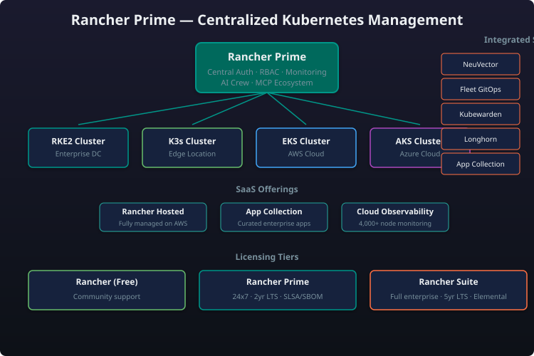

# Module 3: Rancher Prime — Multi-Cluster Management

!!! abstract "Module Overview"
    **Rancher Prime** is SUSE's enterprise-grade container management platform, built on the open-source Rancher project. It provides unified multi-cluster management, AI-powered operations, GPU multi-tenancy, and enterprise assurance — all backed by a single-vendor SLA from SUSE.

---

## What Is Rancher Prime?

Rancher Prime is the **commercial enterprise distribution** of Rancher, designed for organisations that need production-grade Kubernetes management at scale. It wraps the open-source Rancher Kubernetes Management (RKE/RKE2) ecosystem with enterprise SLAs, hardened security profiles, extended lifecycle support, and premium SUSE-backed tooling.

> "Rancher Prime is not 'another Kubernetes distro' — it is the **control plane for all your Kubernetes clusters**, whether they run RKE2, K3s, AKS, EKS, GKE, OpenShift, or vanilla upstream K8s."

---

## Architecture Overview

## Core Capabilities

### Multi-Cluster Management

Rancher Prime provides a single pane of glass for managing hundreds or thousands of Kubernetes clusters across on-premises, cloud, and edge environments:

- **Cluster lifecycle management** — Create, import, upgrade, and delete clusters through a unified API and UI
- **Fleet-based GitOps** — Deploy workloads across fleets of clusters declaratively (see [Module 7: Storage & GitOps](module-07-storage-gitops.md))
- **RBAC federation** — Map organisational roles (Team A, Team B) to Kubernetes namespaces across clusters
- **Centralised observability** — Prometheus + Grafana + logging dashboards aggregated across all clusters
- **Multi-tenancy** — Virtual clusters and project-scoped permissions

### AI-Powered Operations (Crew & MCP)

Rancher Prime introduces AI-assisted cluster operations:

| Capability | Description |
|---|---|
| **Rancher Crew** | AI-driven cluster troubleshooting assistant that diagnoses issues, suggests fixes, and can execute remediation actions via natural language |
| **MCP (Model Context Protocol)** | Standardised protocol for LLM-to-Kubernetes interaction — allows AI models to read cluster state and perform authorised actions through a controlled interface |
| **Intelligent drift detection** | AI-powered comparison of actual vs. desired cluster state with automated remediation proposals |

### GPU Multi-Tenancy

Rancher Prime supports GPU workload isolation through:

- **NVIDIA GPU Operator integration** — Automated GPU driver installation and monitoring
- **Time-slicing & MIG** — Partition GPU resources across multiple tenants
- **GPU quota enforcement** — Per-namespace and per-project GPU limits
- **Observability** — GPU utilisation metrics in the central dashboard

### Cluster Lifecycle

| Feature | Description |
|---|---|
| **Cluster Creation** | One-click deploy of RKE2, K3s, AKS, EKS, GKE, and custom clusters |
| **Cluster Import** | Import any existing K8s cluster (including non-SUSE distros) |
| **Upgrade Orchestration** | Rolling upgrades with health checks, rollback support, and maintenance windows |
| **Backup & Restore** | Integrated etcd backup/restore with S3-compatible storage targets |
| **Certificate Management** | Automated certificate rotation and renewal |

### Observability

- **Built-in monitoring** — Prometheus Operator deployed on each cluster with central aggregation
- **Logging** — Fluentd/Bottlerocket-based logging pipeline with Elasticsearch or Loki backends
- **Alerting** — Centralised alert routing to PagerDuty, Slack, email, Webhook
- **Cost visibility** — Multi-cloud cost allocation dashboards (Prime tier)

### Enterprise Assurance

- **99.9% SLA** on the Rancher Prime management plane
- **Long-term support (LTS)** releases with 2-year maintenance commitment
- **FIPS 140-2** validated cryptographic modules
- **SOC 2 Type II** certified SaaS offerings
- **Vulnerability disclosure program** with SLA-backed patch timelines
- **Single-vendor support** — one phone call for the entire stack

---

## Licensing Tiers Comparison

| Feature | Free / Community | Prime | Suite |
|---|---|---|---|
| **Cluster management** | Up to 5 clusters (Free Rancher) | Unlimited | Unlimited |
| **Rancher UI & API** | :white_check_mark: | :white_check_mark: | :white_check_mark: |
| **Multi-cluster RBAC** | :white_check_mark: | :white_check_mark: | :white_check_mark: |
| **Cluster import (any K8s)** | :white_check_mark: | :white_check_mark: | :white_check_mark: |
| **RKE2 / K3s provisioning** | :white_check_mark: | :white_check_mark: | :white_check_mark: |
| **GitOps with Fleet** | :white_check_mark: | :white_check_mark: | :white_check_mark: |
| **Monitoring & logging** | Basic (single-cluster) | Centralised multi-cluster | Centralised multi-cluster |
| **Enterprise SLA (99.9%)** | :x: | :white_check_mark: | :white_check_mark: |
| **LTS releases (2 year)** | :x: | :white_check_mark: | :white_check_mark: |
| **FIPS 140-2** | :x: | :white_check_mark: | :white_check_mark: |
| **SOC 2 compliance** | :x: | :white_check_mark: | :white_check_mark: |
| **Vulnerability SLA** | :x: | :white_check_mark: | :white_check_mark: |
| **Rancher Crew (AI)** | :x: | :white_check_mark: | :white_check_mark: |
| **GPU multi-tenancy** | :x: | :white_check_mark: | :white_check_mark: |
| **NeuVector container security** | :x: | Add-on | :white_check_mark: |
| **Harvester VM management** | :x: | Add-on | :white_check_mark: |
| **Kubewarden policy engine** | :x: | Add-on | :white_check_mark: |
| **Harvester VM management** | :x: | Add-on | :white_check_mark: |
| **SUSE Manager integration** | :x: | :x: | :white_check_mark: |
| **Premium support (24/7)** | Community support only | Business hours | 24/7 with 1-hour SLA |
| **Pricing model** | Free (no license) | Per-cluster subscription | Per-cluster suite bundle |

---

## SaaS Offerings

Rancher Prime is also available as managed SaaS, reducing operational overhead:

### Rancher Hosted

A fully managed Rancher Prime control plane running on SUSE's infrastructure:

- No need to install, maintain, or upgrade the Rancher management server
- Connect your existing clusters (on-prem or cloud) via agent
- Automatic upgrades to latest Prime release
- Included in Prime licensing tier

### App Collection on AWS

Pre-hardened, Rancher-managed application stack available on AWS Marketplace:

- One-click deploy of Rancher Prime + NeuVector + Kubewarden + Longhorn
- Integrated billing through AWS
- Pre-configured security policies and compliance baselines

### Cloud Observability on AWS

Managed observability backplane for Rancher-managed clusters:

- Centralised metrics, logs, and traces stored in SUSE-managed S3
- Pre-built dashboards for Kubernetes health, cost, and security
- 90-day retention included; extendable

---

## Rancher Prime vs Rancher (Community)

| Dimension | Rancher (Community) | Rancher Prime |
|---|---|---|
| **Licence** | Apache 2.0 | Commercial (subscription) |
| **Support** | Community (GitHub Issues, forums) | SUSE Enterprise Support with SLA |
| **Release cadence** | Rolling, no LTS | LTS releases with 2-year support |
| **Security patching** | Best-effort | SLA-backed with CVE timelines |
| **Certified integrations** | Community-tested | SUSE-tested and validated |
| **FIPS / SOC 2** | Not available | Included |
| **AI operations (Crew)** | Not available | Included |
| **Cluster limit** | 5 clusters in UI (no limit via API) | Unlimited |
| **Upgrade assistance** | Manual | Automated with rollback |

!!! tip "When to choose Prime over Community"
    If you run Kubernetes in production — especially across multiple clusters, in regulated industries, or with compliance requirements — Rancher Prime's SLA, LTS, FIPS, and support are worth the subscription. The Community edition is excellent for dev/test, labs, and smaller deployments.

---

## The "Why Rancher Prime" Positioning Script

> "Your customers are running Kubernetes on AWS, on-prem with RKE2, and at the edge with K3s — each with different security policies, different upgrade cycles, and different teams. They need **one control plane** that can federate all of them, while meeting enterprise compliance.
>
> **Rancher Prime is that control plane.**
>
> It's the only platform that gives you multi-cluster management, AI-powered operations via Crew and MCP, GPU multi-tenancy for ML workloads, and enterprise assurance with SLA, FIPS, and SOC 2 — all backed by SUSE as a single vendor.
>
> No stitching together open-source components. No explaining to auditors why you're using community builds. Just one subscription, one support line, one platform."

---

## Integration Points

Rancher Prime is the hub of the SUSE Cloud Native ecosystem. Key integrations include:

### NeuVector — Container Security

Rancher Prime integrates deeply with [NeuVector](module-04-neuvector.md) for runtime security:

- Single-click NeuVector deployment on any managed or imported cluster
- Security events appear in the Rancher Prime dashboard
- NeuVector admission controls integrate with Rancher's policy engine
- Vulnerability scan results visible per-namespace and per-project

### Kubewarden — Policy as Code

[Kubewarden](module-08-kubewarden.md) policies can be applied at the cluster level through Rancher Prime:

- Manage Kubewarden policies from the Rancher UI
- Enforce admission policies across fleets via Fleet
- Audit mode for dry-run policy evaluation

### Fleet — GitOps

Fleet is the built-in GitOps engine in Rancher Prime:

- Deploy workloads to hundreds of clusters from a single Git repository
- Support for Helm, Kustomize, and raw YAML
- Drift detection and automatic reconciliation

### Longhorn — Persistent Storage

[Longhorn](module-07-storage-gitops.md) delivers enterprise-grade block storage:

- Deployed through Rancher Prime's app catalog
- Integrated backup to S3-compatible targets
- Volume snapshot and restore from the Rancher UI

### Harvester — Virtualization

[Harvester](module-05-harvester.md) VMs appear alongside containers in the Rancher Prime dashboard:

- Unified VM + container management
- VM-to-Pod networking across Harvester and RKE2 clusters
- Harvester images managed through Rancher's container registry

---

## Summary

| Topic | Key Takeaway |
|---|---|
| **What it is** | Enterprise Kubernetes management platform |
| **Killer feature** | One control plane for any K8s cluster, anywhere |
| **AI differentiator** | Rancher Crew + MCP for AI-driven operations |
| **Security** | FIPS 140-2, SOC 2, SLA-backed patching |
| **Licensing** | Free (5-cluster limit) → Prime (unlimited) → Suite (bundle) |
| **SaaS options** | Rancher Hosted, App Collection on AWS, Cloud Observability on AWS |
| **Key integrations** | NeuVector, Kubewarden, Fleet, Longhorn, Harvester |

---

## Further Reading

- [Module 2: Kubernetes Distributions (RKE2, K3s)](module-02-k8s-distributions.md) — The clusters Rancher Prime manages
- [Module 4: Security with NeuVector](module-04-neuvector.md) — Deep dive on container security
- [Module 5: Virtualization with Harvester](module-05-harvester.md) — VM management alongside containers
- [Module 7: Storage & GitOps](module-07-storage-gitops.md) — Longhorn and Fleet deep dive
- [Module 8: Policy as Code with Kubewarden](module-08-kubewarden.md) — Admission policies for Rancher clusters
- [Module 11: MultiLinux Management](module-11-multilinux.md) — Managing heterogenous Linux environments alongside Kubernetes
