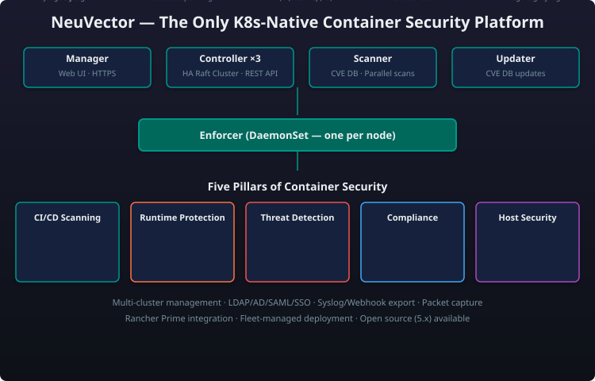

# Module 4: Security — NeuVector

!!! abstract "Module Overview"
    **NeuVector** is the only Kubernetes-native container security platform, providing full-lifecycle security from CI/CD pipeline scanning through runtime threat detection and response. It is a core pillar of the SUSE Cloud Native security posture.

---

## What Is NeuVector?

NeuVector is an open-source-first container security platform that delivers **full lifecycle security** for Kubernetes workloads. It is purpose-built for containerised environments — not a traditional security tool retrofitted for K8s.

> "NeuVector is the **only Kubernetes-native container security platform** — purpose-built from day one for containers and orchestrated by Kubernetes. It is not a ported VM security tool or a sidecar injection strategy. It understands Pods, namespaces, cluster ingress, and container networking natively."

Key differentiators:

- **No sidecar injection** — NeuVector enforces security at the kernel level using eBPF and netfilter
- **Kubernetes-aware** — It understands Pods, services, namespaces, and labels natively
- **Full lifecycle** — From `docker build` to production runtime, one platform covers the entire pipeline

---

## Architecture Overview

## The 5 Pillars of NeuVector

### 1. CI/CD Vulnerability Management + Admission Control

NeuVector plugs into your CI/CD pipeline to catch vulnerabilities before they reach production:

- **Image scanning** — Integrates with Jenkins, GitLab CI, GitHub Actions, and others
- **Registry scanning** — Continuously scan container registries (Harbor, Docker Hub, ECR, ACR, GCR)
- **Base OS + package scanning** — Detects CVEs in Alpine, Ubuntu, Debian, RHEL, and others
- **Admission control** — Kubernetes ValidatingWebhook that blocks deployments failing policy (e.g., critical CVE, outdated base image, missing signature)
- **SBOM generation** — SPDX-compliant software bill of materials for every image

An admission control rule can be configured to block deployments with critical CVEs or missing image signatures, using a Kubernetes ValidatingWebhook.

### 2. Runtime Violation Protection

NeuVector monitors container behaviour at runtime and detects violations:

- **Process profiling** — Learns expected process trees per container; alerts on unexpected execs
- **File system protection** — Monitors reads/writes to critical paths; blocks unauthorised modifications
- **Network micro-segmentation** — Auto-generates per-container network rules based on learned behaviour
- **Container drift detection** — Detects when a container deviates from its original image (e.g., package install at runtime)
- **Privilege escalation detection** — Alerts on unexpected privilege escalation attempts

| Runtime Event | NeuVector Response |
|---|---|
| `kubectl exec` into a Pod | Alert + optional block |
| New process spawned (e.g., `curl`, `nc`) | Alert; auto-generate process rule |
| Container writes to `/etc/passwd` | Alert + file system lockdown |
| Unexpected outbound connection | Alert + auto-block (zero-trust mode) |

### 3. Threat Detection (DLP + WAF)

NeuVector includes application-layer threat detection:

- **DLP (Data Loss Prevention)** — Inspects container traffic for sensitive data patterns (credit cards, PII, API keys, tokens)
- **WAF (Web Application Firewall)** — Protects containerised applications from OWASP Top 10 attacks: SQLi, XSS, command injection, path traversal
- **Network behaviour analytics** — Detects C2 (command & control) beaconing, port scanning, DNS tunnelling
- **Integrated IPS/IDS** — Signature-based and anomaly-based network intrusion prevention

A DLP rule can be configured to detect exposed credentials (API keys, secrets, tokens) in container traffic, using regex pattern matching with configurable alert or block actions.

### 4. Compliance Auditing

NeuVector automates compliance auditing against major frameworks:

- **CIS Benchmarks** — Automated checks for Kubernetes (CIS K8s Benchmark), Docker, and Linux hosts
- **NSA/Kubernetes Hardening Guide** — Alignment with NSA's hardening recommendations
- **NIST SP 800-190** — Container security standards compliance
- **PCI DSS, HIPAA, GDPR** — Regulatory mapping and evidence collection
- **Custom compliance profiles** — Define organisation-specific compliance checks

!!! tip "Compliance automation"
    NeuVector's compliance scanning runs on a schedule and generates downloadable reports suitable for auditor review. No manual checklist chasing.

### 5. Endpoint / Host Security

NeuVector protects the underlying host nodes as well:

- **Host vulnerability scanning** — Scans for CVEs on cluster nodes (OS packages, kernel)
- **Host process monitoring** — Detects suspicious processes running on nodes outside containers
- **Host file integrity monitoring (FIM)** — Monitors critical host paths (/etc, /usr/bin, /boot)
- **Cluster-wide compliance** — Applies CIS benchmarks to host OS configuration
- **Node-level network security** — Protects host network interfaces

---

## Architecture

NeuVector uses a distributed, microservices-based architecture with five core components:

| Component | Role |
|---|---|
| **Manager** | Web UI (port 8443), REST API (port 10443), admin console, policy management, dashboard |
| **Controller** | 3 or 5 replicas with Raft consensus — orchestration leader, policy distribution, cluster state management, multi-cluster federation |
| **Enforcer** | DaemonSet per node — kernel-level enforcement via eBPF, packet inspection, process/file monitoring, network policy enforcement |
| **Scanner** | Auto-scaled deployment — image vulnerability scanning, registry scanning, CIS benchmark checks, SBOM generation |
| **Updater** | CronJob — periodically downloads CVE database updates and signature rules |

### Component Roles

| Component | Deployment | Role |
|---|---|---|
| **Manager** | 1 replica (can be scaled for web UI HA) | Web console, API endpoint, policy definition, dashboard, user management |
| **Controller** | 3 or 5 replicas (Raft consensus) | Orchestration leader, policy distribution, cluster state management, multi-cluster federation |
| **Enforcer** | DaemonSet (1 per node) | Kernel-level enforcement via eBPF, packet inspection, process/file monitoring, network policy enforcement |
| **Scanner** | Deployment (auto-scaled) | Image vulnerability scanning, registry scanning, CIS benchmark checks, SBOM generation |
| **Updater** | CronJob | Periodically downloads CVE database updates and signature rules from NeuVector cloud |

---

## Deployment Patterns

### Pattern 1: High Availability (Recommended for Production)

Best for production environments with strict uptime requirements:

For production environments with strict uptime requirements, this pattern deploys 3 Controller pods (Raft consensus, tolerates 1 failure), 1 Manager pod, a Scanner pod (auto-scaled to 3 during scans), an Enforcer DaemonSet on every node, an Updater CronJob, and a LoadBalancer or Ingress for the Manager UI. It tolerates a single controller failure with ~5 second failover and is recommended for production clusters with more than 5 nodes.

- **Tolerates** a single controller failure
- **Failover time** ~5 seconds
- **Recommended for** production clusters with >5 nodes

### Pattern 2: All-in-One (Single Replica)

Best for development, testing, and smaller clusters:

For development, testing, and smaller clusters, this pattern deploys a single Controller replica (no HA), a co-located Manager, one Scanner, an Enforcer DaemonSet on every node, and an Updater CronJob. It has no HA (controller restart causes brief policy interruption) with a footprint of approximately 1 vCPU / 2 GB RAM plus enforcer per node. Recommended for dev/test clusters and clusters with fewer than 5 nodes.

- **No HA** — controller restart causes brief policy interruption
- **Footprint** ~1 vCPU / 2 GB RAM (plus enforcer per node)
- **Recommended for** dev/test clusters and clusters with <5 nodes

### Pattern 3: Per-Node DaemonSet (Enforcer-Only Mode)

For air-gapped or resource-constrained environments:

For air-gapped or resource-constrained environments, a central Controller/Manager runs on a management cluster while an Enforcer-only DaemonSet is deployed on each workload cluster. Enforcers report back to the central Controller, and Scanners run on the management cluster only. This provides minimal footprint on workload nodes (~0.3 vCPU / 512 MB RAM per enforcer), centralised management via a single console for all clusters, and is ideal for edge clusters, air-gapped deployments, and ARM nodes.

- **Minimal footprint** on workload nodes (~0.3 vCPU / 512 MB RAM per enforcer)
- **Centralised management** — one console for all clusters
- **Recommended for** edge clusters, air-gapped deployments, ARM nodes

---

## NeuVector vs Falco vs Aqua

| Dimension | NeuVector | Falco | Aqua Security |
|---|---|---|---|
| **K8s-native** | :white_check_mark: Built for K8s from day one | :warning: Runtime-focused, needs integrations | :warning: Originated as VM-era tool, adapted for K8s |
| **CI/CD scanning** | :white_check_mark: Full CI/CD pipeline integration | :x: Not included | :white_check_mark: Full pipeline scanning |
| **Runtime security** | :white_check_mark: eBPF + netfilter dual-engine | :white_check_mark: eBPF-based syscall monitoring | :white_check_mark: eBPF + sidecar approaches |
| **WAF / DLP** | :white_check_mark: Built-in L7 inspection | :x: Not included | :white_check_mark: Add-on module |
| **Network micro-segmentation** | :white_check_mark: Auto-learn + enforce | :warning: Alerts only (no enforce) | :white_check_mark: Full enforcement |
| **Admission control** | :white_check_mark: Built-in ValidatingWebhook | :x: Falco Admission Controller (separate) | :white_check_mark: Built-in |
| **Compliance auditing** | :white_check_mark: CIS, NIST, PCI, HIPAA, GDPR | :warning: Limited to Falco rules | :white_check_mark: Full compliance suite |
| **Host security** | :white_check_mark: Host scanning + FIM | :x: Container-focused only | :white_check_mark: Host + container |
| **Open-source** | :white_check_mark: Apache 2.0 (core) | :white_check_mark: Apache 2.0 | :x: Proprietary (core) |
| **Integration with Rancher** | :white_check_mark: Native (one-click deploy) | :warning: Manual integration | :warning: Manual integration |
| **Pricing** | Free (community) + Prime subscription | Free (open-source) | Per-node license (expensive) |

| Dimension | Winner |
|---|---|
| **Best K8s-native security** | NeuVector |
| **Best free runtime monitoring** | Falco |
| **Best enterprise suite (non-SUSE)** | Aqua |
| **Best Rancher integration** | NeuVector |
| **Best open-source community** | Falco |

---

## Integration with Rancher Prime

NeuVector integrates seamlessly with [Rancher Prime](module-03-rancher-prime.md):

### One-Click Deployment

- NeuVector appears in the Rancher Prime Apps & Marketplace catalog
- Deploy to any managed or imported cluster with a single click
- Pre-configured security profiles aligned with Rancher's hardening guides

### Unified Dashboard

- Security events (critical CVEs, runtime violations) appear in the Rancher Prime dashboard
- NeuVector vulnerability reports per-namespace and per-project
- Alert notifications routed through Rancher's alerting system

### Policy Federation

- Define NeuVector security policies at the Rancher level
- Propagate policies to all clusters via Fleet GitOps
- Enforce consistent security posture across development, staging, and production

### Cross-Cluster Visibility

- One NeuVector console managing security across all Rancher-managed clusters
- Centralised compliance reporting for multi-cluster environments
- Federated CVE scanning across registries used by all clusters

A Fleet GitOps bundle can deploy NeuVector across all production clusters with a single configuration, specifying controller replicas, enforcer, scanner, and admission control settings via Helm values.

---

## The "Why NeuVector" Positioning Script

> "Your customer asks: 'We already run Falco for runtime security and Trivy for scanning — why do we need NeuVector?'
>
> **Here's why:** You're stitching together four different tools for four different jobs — Falco for runtime, Trivy for scanning, a separate admission controller, and a separate WAF. None of them talk to each other. None of them are Kubernetes-native. And none of them are backed by an enterprise SLA.
>
> **NeuVector replaces all four with one platform.** One agent, one policy model, one dashboard, one support line. It's the only container security platform that covers the full lifecycle — CI/CD scanning, admission control, runtime protection, DLP/WAF, compliance auditing, and host security — in a single, Kubernetes-native deployment.
>
> And because it integrates natively with Rancher Prime, you get security policies that travel with your workloads across dev, staging, and production — without reconfiguration."

---

## Summary

| Topic | Key Takeaway |
|---|---|
| **What it is** | Only K8s-native full-lifecycle container security platform |
| **5 pillars** | CI/CD vuln mgmt, runtime protection, threat detection (DLP+WAF), compliance auditing, host security |
| **Architecture** | Manager + Controller (Raft) + Enforcer (eBPF DaemonSet) + Scanner + Updater |
| **Deployment** | HA (3 controllers), All-in-One (single), Enforcer-only (edge/air-gapped) |
| **vs Falco** | NeuVector is broader (WAF, DLP, compliance, admission); Falco is narrower (runtime only) but fully open-source |
| **vs Aqua** | NeuVector is more K8s-native, open-source core, and cheaper; Aqua is more mature as a pure-play enterprise suite |
| **Rancher integration** | One-click deploy, unified dashboard, policy federation via Fleet |
| **Open-source** | Core is Apache 2.0; enterprise features in Prime subscription |

---

## Further Reading

- [Module 3: Rancher Prime Multi-Cluster Management](module-03-rancher-prime.md) — The platform NeuVector integrates with
- [Module 9: Ecosystem & Competitive Landscape](module-09-ecosystem-competitive.md) — How NeuVector compares to the broader security market
- [Module 11: MultiLinux Management](module-11-multilinux.md) — Managing heterogeneous Linux distributions across the Kubernetes fleet
