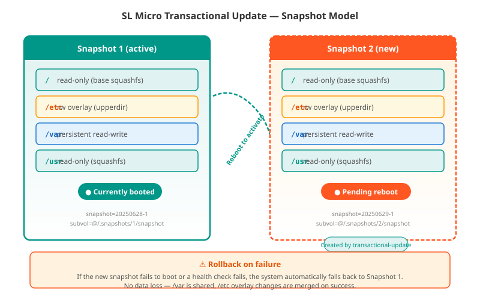
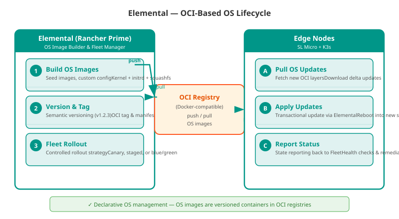
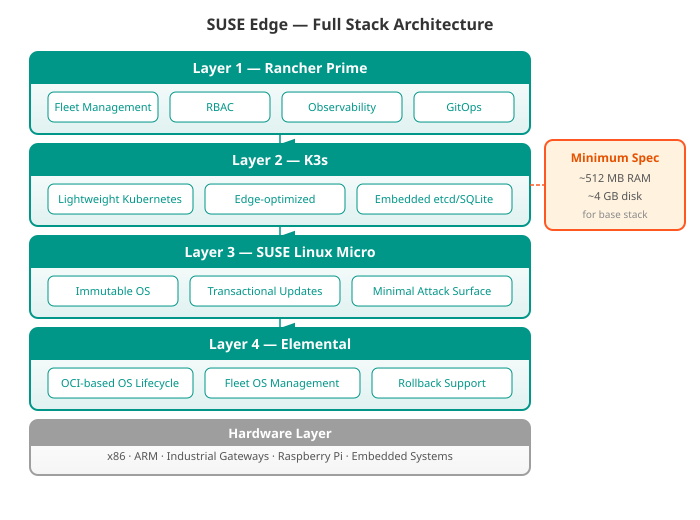

# Module 6: Edge Computing — SUSE Edge & Linux Micro

!!! note "Module Context"
    This module covers the SUSE Edge platform — the full stack for Kubernetes at the edge. Edge environments combine lightweight Kubernetes (K3s), immutable OS (SUSE Linux Micro), OCI-based OS management (Elemental), and integrated security (NeuVector). For K3s fundamentals, see [Module 2: Kubernetes Distributions](module-02-k8s-distributions.md). For management tooling, see [Module 3: Rancher Prime](module-03-rancher-prime.md). For edge security, see [Module 4: NeuVector](module-04-neuvector.md).

## The SUSE Edge Platform

The SUSE Edge platform is a comprehensive solution for deploying, managing, and securing Kubernetes at the edge. It addresses the unique constraints of edge environments — limited bandwidth, intermittent connectivity, constrained hardware, and unattended operation.

### Platform Variants

SUSE Edge ships in three variants tailored to different operational domains:

| Variant | Target Environment | Key Differentiators |
|---|---|---|
| **SUSE Edge** | General-purpose edge (retail, IoT, branch offices) | K3s + Linux Micro + Elemental + Rancher Prime; standard lifecycle |
| **SUSE Industrial Edge** | Manufacturing, OT, smart factories | Real-time kernel, TSN networking, OPC UA integration, IEC 62443 |
| **SUSE Telco Cloud** | 5G, NFV, telecom infrastructure | DPDK, SR-IOV, CPU pinning, NFV orchestration, ETSI MANO alignment |

### SUSE Linux Micro — The Immutable OS Foundation

!!! tip "Choosing the Right Variant"
    If you need standard Kubernetes at the edge with managed lifecycle — **SUSE Edge**. If you are in a manufacturing floor (PLC integration, deterministic networking) — **Industrial Edge**. If you are building a 5G core or vRAN — **Telco Cloud**. All three share the same foundation: Linux Micro + Elemental + K3s.

## SUSE Linux Micro — Deep Dive

SUSE Linux Micro (SL Micro) is the host operating system for SUSE Edge. It is **immutable, container-optimized, and transactionally updated**.

### Design Principles

| Principle | What It Means |
|---|---|
| **Immutable** | Root filesystem is read-only at runtime; no package drift |
| **Atomic updates** | Updates are applied as a single transaction — success or full rollback |
| **Container-native** | All applications run in containers; no package installation on host |
| **Minimal footprint** | ~300 MB base install; no GUI, no unnecessary services |
| **Measured boot** | Full TPM 2.0 + SecureBoot chain of trust |
| **Transactional updates** | `transactional-update` tool applies OS updates as snapshots |

### Transactional Update Model

When an update is available:

1. `transactional-update up` creates a new snapshot
2. Updates are applied to the *new* snapshot (active system untouched)
3. On next reboot, the system boots into the new snapshot
4. If boot fails or health check fails, the system rolls back to the previous snapshot
5. Rollback is instantaneous — no re-install, no repair

!!! warning "No Package Management"
    You do **not** use `zypper` or `rpm` directly on SL Micro. All software beyond the base OS must be containerized (podman, Docker, or containerd). This is by design — it guarantees consistency and prevents configuration drift.

### System Management

| Component | Purpose |
|---|---|
| `transactional-update` | Apply OS updates, kernel, firmware atomically |
| `snapper` | Manage Btrfs snapshots; rollback to known-good state |
| `combustion` | First-boot configuration (network, users, registration) |
| `ignition` | Declarative provisioning (YAML-based disk config) |
| `podman` | Container runtime for management agents |
| `elemental-operator` | Connects to Elemental for fleet OS management |

## Elemental — OCI-Based OS Management

Elemental is the **OS lifecycle manager** for SUSE Edge. It treats operating system images as OCI containers — the same workflow used for application containers.

### How Elemental Works

| Elemental Concept | Description |
|---|---|
| **MachineRegistrations** | CRD defining how nodes register with Rancher |
| **OSImage** | OCI-based container image containing the full OS (kernel, initrd, rootfs) |
| **ManagedOSVersion** | Version catalog — which OS versions are available to which nodes |
| **ManagedOSVersionChannel** | Update channel sync — syncs OS versions from a registry |
| **Rollout Strategy** | Canary, rolling, or blue-green update across the fleet |

### Key Advantages Over Traditional OS Management

| Approach | Traditional (Ansible/Packer) | Elemental (OCI-based) |
|---|---|---|
| Image format | Raw disk images, qcow2, ISO | OCI container images |
| Versioning | File naming, metadata | OCI tags, digests |
| Rollout | Custom scripts | Kubernetes-native rollout controller |
| Rollback | Manual re-image | One-reboot revert to previous OCI image |
| Air-gapped | Full image transfer | OCI registry mirror (same tooling as app containers) |
| Audit trail | OS logs, build server | Container registry history, signed manifests |

!!! tip "Elemental + Registries"
    Elemental images are stored in standard OCI registries (Docker Hub, Harbor, Quay, private registry). If your organization already uses container registries, you can use the same infrastructure for OS images — same RBAC, same signing, same mirroring for air-gapped deployments.

## K3s at the Edge — Why Lightweight Matters

K3s is the Kubernetes distribution of choice for edge deployments. It replaces the standard K8s control plane with a single, small binary.

### K3s Edge Optimizations

| Optimization | Impact at Edge |
|---|---|
| **Single binary** (~60 MB) | Minimal storage on constrained devices |
| **Embedded etcd or SQLite** | No separate HA database cluster needed |
| **Low memory footprint** (~256 MB idle) | Runs on Raspberry Pi 4, Intel NUC, industrial gateways |
| **Built-in Helm controller** | Deploy apps without Tiller/server-side Helm |
| **Auto-deploy manifests** | `/var/lib/rancher/k3s/server/manifests/` — Kubernetes manifests applied on boot |
| **Traefik ingress (optional)** | Lightweight ingress controller included |
| **Flannel / Calico / Cilium** | Choice of CNI; Flannel default for minimal overhead |

### Comparison: K3s vs RKE2 at Edge

| Criteria | K3s | RKE2 |
|---|---|---|
| Binary size | ~60 MB | ~200 MB |
| Memory at idle | ~256 MB | ~500 MB |
| Database | SQLite (single-node) or embedded etcd | Embedded etcd |
| Containerd | Embedded | Embedded |
| CIS hardening | Optional profile | Hardened by default |
| Ideal use case | Edge, IoT, resource-constrained | Data center, compliance-heavy |

!!! note "K3s in SUSE Edge"
    SUSE Edge ships K3s as the default Kubernetes distribution. The SUSE Linux Micro + K3s combination requires only ~512 MB RAM and 4 GB disk for the base stack — leaving more resources for workloads. See [Module 2: Kubernetes Distributions](module-02-k8s-distributions.md) for the full K3s/RKE2 comparison.

## The Full Edge Stack

The SUSE Edge platform integrates four components into a unified stack:

### How the Stack Works Together

| Layer | Role in Operations |
|---|---|
| **Linux Micro** | Provides the immutable, secure host OS that cannot be modified at runtime |
| **Elemental** | Manages OS updates fleet-wide via OCI registries; rollbacks are automatic |
| **K3s** | Runs the Kubernetes control plane and workloads in a minimal footprint |
| **Rancher Prime** | Manages clusters, RBAC, application catalog, observability, updates |
| **NeuVector** | Secures container traffic, scans images for CVEs, enforces network policies |

## Use Cases

### Manufacturing (Smart Factory) — SUSE Industrial Edge

Requirements met by SUSE Edge:

- **Deterministic networking** — TSN (Time-Sensitive Networking) for PLC coordination
- **Real-time kernel** — PREEMPT_RT for sub-millisecond control loops
- **IEC 62443 compliance** — Industrial cybersecurity standards
- **OT-safe updates** — Transactional updates with automatic rollback
- **Offline operation** — Update images cached locally; operations continue without internet

!!! tip "Factory Floor Best Practice"
    Use SUSE Industrial Edge with **air-gapped Elemental registries**. OS updates are pulled from a local Harbor registry on the plant floor network, never touching the internet. NeuVector's container drift prevention ensures only signed, approved images run in production.

### Telecom (5G) — SUSE Telco Cloud

Requirements met by SUSE Edge:

- **DPDK / AF_XDP** — Kernel-bypass networking for 5G user plane
- **SR-IOV** — NIC hardware partitioning for multiple VNFs/CNFs
- **CPU pinning** — Dedicated cores for real-time NFV workloads
- **Huge pages** — 1 GB huge page support for memory-intensive 5G functions
- **ETSI NFV compliance** — Aligns with NFV MANO framework
- **Zero-touch provisioning** — Remote site deployment with Elemental

### Retail

- **Point-of-sale (POS)** systems as K3s pods
- **Inventory management** at store level with local databases
- **Video analytics** (loss prevention) with GPU-accelerated inferencing
- **Back-office servers** consolidated onto edge nodes
- **Central management** from HQ via Rancher Prime

### IoT / Remote Sites

- **Sensor data ingestion** at oil wells, weather stations, agricultural sites
- **Local processing** with edge AI (TensorFlow Lite, ONNX Runtime)
- **Store-and-forward** data pipelines when connectivity is intermittent
- **Solar-powered nodes** with power-loss safe transactional filesystem

---

> **SUSE Cloud Native Positioning:**
> *"Edge computing forces a fundamental rethink of infrastructure management. You cannot SSH into 10,000 retail stores. You cannot rebuild a gateway at an oil well. SUSE Edge solves this with a container-native OS lifecycle: the same OCI registry that holds your application containers now holds your operating system. Update the OS the same way you update a pod — declaratively, fleet-wide, with automatic rollback. That's the operational model edge demands, and only SUSE delivers it as an integrated whole."*
>
> — SUSE CTO Office, Cloud Native Solutions

---

## Cross-References

| Module | Topic | Link |
|---|---|---|
| Module 2 | K3s and Kubernetes distributions (edge-optimized K8s) | [module-02-k8s-distributions.md](module-02-k8s-distributions.md) |
| Module 3 | Rancher Prime — managing edge clusters at scale | [module-03-rancher-prime.md](module-03-rancher-prime.md) |
| Module 4 | NeuVector — container security for edge workloads | [module-04-neuvector.md](module-04-neuvector.md) |
|| Module 5 | Harvester — virtualization for edge HCI scenarios | [module-05-harvester.md](module-05-harvester.md) |
|| Module 11 | MultiLinux Management | [module-11-multilinux.md](module-11-multilinux.md) |
