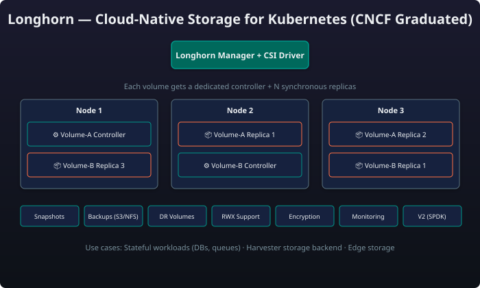
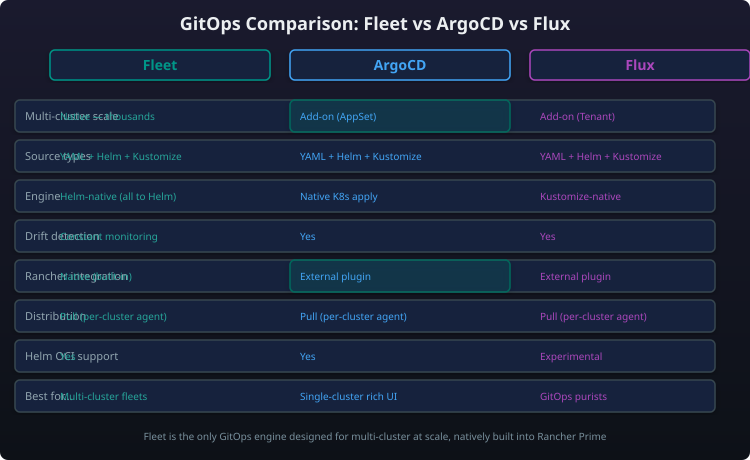

# Module 7: Storage & GitOps — Longhorn & Fleet

!!! abstract "Module Overview"
    **Longhorn** is the CNCF-graduated distributed block storage system for Kubernetes, providing enterprise-grade persistent storage with synchronous replication, snapshots, backups, and encryption. **Fleet** is the built-in GitOps engine in Rancher Prime, enabling declarative workload management across hundreds of clusters. Together they form the data persistence and deployment automation backbone of the SUSE Cloud Native stack.

---

## Part 1: Longhorn — Distributed Block Storage

### What Is Longhorn?

Longhorn is a **CNCF-graduated** (formerly CNCF Incubating) **distributed block storage system** built natively for Kubernetes. Unlike traditional SAN/NAS solutions that require external hardware and proprietary protocols, Longhorn runs entirely as a set of containers on your Kubernetes cluster — turning the local disks of each cluster node into a unified, highly available storage pool.

| Property | Traditional SAN/NAS | Longhorn |
|---|---|---|
| Architecture | External appliance, Fibre Channel/iSCSI | Software-defined, Kubernetes-native |
| Protocol | FC, iSCSI, NFS, SMB | **Longhorn Engine** (custom block protocol over TCP) |
| Replication | Appliance-based (RAID, SAN replication) | **Per-volume synchronous replication** (2x/3x) |
| Provisioning | LUNs, volumes via storage admin | **CSI driver** — `PersistentVolumeClaim` → dynamic volume |
| Cost | $10K–$100K+ per appliance | Zero additional hardware; runs on cluster nodes |
| Management | Dedicated admin console | `kubectl`, Longhorn UI, Rancher Prime dashboard |

!!! tip "Key Insight"
    Longhorn is not an external storage appliance retrofitted for Kubernetes. It is **built from the ground up for Kubernetes** — every volume is a Kubernetes resource, every operation goes through the CSI driver, and the control plane runs as pods on the cluster itself.

### Architecture



Longhorn's architecture is **microservice-based**, with three core components working together:

| Component | Role |
|---|---|
| **Longhorn Manager** | Kubernetes operator/controller; watches CRDs (`Volume`, `Engine`, `Replica`, `Backup`, `Snapshot`), schedules replicas, handles failover, exposes API and UI |
| **Longhorn Engine** | **Dedicated controller per volume** — a Linux process that fronts all I/O to a volume, handles synchronous replication writes across replicas, and rebuilds replicas after node recovery |
| **Longhorn Replica** | One Linux process per replica copy; stores volume data as a sparse file on a local disk or directory; each replica is an independent copy of the volume's data |

!!! note "Dedicated Storage Controllers"
    Each Longhorn volume gets its own **dedicated Engine controller** process. This is a critical architectural difference from shared-storage systems (like Ceph RBD) where a single OSD serves many volumes. The dedicated engine means:
    - I/O for one volume is isolated from others (no noisy-neighbour at the controller level)
    - A crash in one engine affects only that volume
    - Each engine can be tuned independently (block size, queue depth, replica count)

#### Synchronous Replication

Longhorn replicates every write **synchronously** across all replicas of a volume:

1. Application writes to the volume via the CSI driver
2. The Longhorn Engine receives the write I/O
3. The engine writes to **all** replicas in parallel
4. The engine waits for **acknowledgement from a quorum** (e.g., 2 out of 3 replicas)
5. Only then does the write complete to the application

This ensures **no data loss** on node failure — if a node goes down, the remaining replicas have the latest data.

| Replication Factor | Quorum Required | Node Failures Tolerated | Usable Capacity |
|---|---|---|---|
| 1x (no HA) | 1/1 | 0 | 100% |
| 2x | 1/2 | 0 (split-brain risk) | 50% |
| 2x + RWO | 2/2 (strong consistency) | 0 | 50% |
| **3x (recommended)** | **2/3** | **1** | **33%** |

A StorageClass configured with 3x synchronous replication ensures high availability and tolerates one node failure.

### Key Features

#### Snapshots

Longhorn supports **instantaneous, space-efficient snapshots** using copy-on-write (CoW):

- **Zero-cost creation** — snapshots are instantaneous regardless of volume size
- **Chain-based** — snapshots form a chain; each snapshot stores only the delta from the previous
- **CRD-managed** — `Snapshot` resource in Kubernetes
- **Restore** — revert to any snapshot in the chain
- **Delete** — snapshots can be removed; data merges into the parent (may be slow for large deltas)

Create a Longhorn snapshot named `pre-upgrade-backup` using kubectl to capture the current state of `my-app-volume` before a maintenance operation.

#### Backups (S3 / NFS)

Longhorn backs up snapshots to external targets — not just within the cluster:

| Target Type | Example | Use Case |
|---|---|---|
| **S3-compatible** | AWS S3, MinIO, Ceph RADOS Gateway, DigitalOcean Spaces | Cloud backup, DR across regions |
| **NFS** | NFSv4 server, NAS appliance | On-premises backup, air-gapped environments |
| **Azure Blob** | Azure Blob Storage | Azure-native workloads |
| **GCP** | Google Cloud Storage | GCP-native workloads |

A Backup CRD triggers an on-demand volume backup to an S3-compatible target, while a BackupTarget CRD configures the persistent backup destination and polling interval.

#### Disaster Recovery (DR) Volumes

DR volumes allow **cross-cluster or cross-region recovery**:

- A DR volume is a read-only replica of a volume's backup in a **different cluster**
- It continuously pulls the latest backup data from the backup target (S3/NFS)
- On failover, the DR volume is activated (promoted to read-write) and used as the primary volume
- **No data rehydration delay** — the data is already present locally from the continuous sync

Activate a DR volume on failover by annotating it to restore to read-write state, promoting the replicated backup to the primary volume.

#### RWX Support

Longhorn supports **ReadWriteMany (RWX)** volumes — multiple Pods can read and write to the same volume simultaneously:

- **Shared file system** — uses a **NFSv4 server** (share-manager pod) per RWX volume
- **Underlying block storage** — still uses Longhorn's replicated block storage; the NFS layer is a thin front-end
- **Performance** — adequate for most shared workloads; not a replacement for parallel FS (Lustre, GPFS) for HPC

| Access Mode | Longhorn Support | Typical Use Cases |
|---|---|---|
| **RWO** (ReadWriteOnce) | :white_check_mark: Native | Databases, message queues, any single-Pod consumer |
| **RWX** (ReadWriteMany) | :white_check_mark: NFS front-end | Shared file stores, media pipelines, web server content |
| **ROX** (ReadOnlyMany) | :white_check_mark: Via snapshot/restore | Data distribution, ML model serving |

#### Encryption

Longhorn supports **volume-level encryption** using Linux `dm-crypt` / LUKS:

- **At-rest encryption** — each replica is encrypted independently
- **Per-volume keys** — each volume can have its own passphrase or key
- **Key management** — keys stored in Kubernetes Secrets (or external KMS in Prime)
- **Performance impact** — minimal (~5–10% overhead with AES-NI hardware)

An encrypted StorageClass enables LUKS-based at-rest encryption via dm-crypt, with per-volume keys managed through Kubernetes Secrets.

#### CSI Driver

Longhorn's **CSI (Container Storage Interface) driver** is fully compliant with the Kubernetes CSI specification:

| CSI Feature | Longhorn Support |
|---|---|
| Dynamic provisioning | :white_check_mark: |
| Block volume support | :white_check_mark: |
| Mount option support | :white_check_mark: |
| Volume expansion (online resize) | :white_check_mark: |
| Volume cloning | :white_check_mark: |
| Volume snapshots | :white_check_mark: |
| Volume group snapshots | :white_check_mark: |
| Seamless PVC migration | :white_check_mark: |

#### Monitoring

Longhorn provides **built-in monitoring** via:

- **Longhorn UI** — Web dashboard with volume health, replica status, node disk usage, backup progress
- **Prometheus metrics endpoint** — Exposes volume I/O, replica status, node disk, and engine metrics
- **Grafana dashboard** — Pre-built dashboard (available in the Longhorn repo) for cluster-wide storage observability
- **Alerting** — Critical alerts: volume degraded, replica failure, disk pressure, backup failure

A PrometheusRule alert fires when a Longhorn volume enters degraded state, with configurable severity and notification routing.

#### V2 Data Engine (SPDK)

The **V2 Data Engine**, introduced in Longhorn v1.5+, replaces the V1 Engine with a **SPDK-based** (Storage Performance Development Kit) data path:

| Aspect | V1 Engine | V2 Engine (SPDK) |
|---|---|---|
| Data path | Linux block layer + iSCSI/tcp | **SPDK** — kernel-bypass, userspace NVMe/TCP |
| Latency | ~100–200 µs | **~10–20 µs** (10x improvement) |
| Throughput | Moderate | **2–3x higher IOPS** |
| CPU usage | Low | Slightly higher (poll-mode drivers) |
| Replication | Engine-internal synchronous | **NVMe-oF native** replication |
| Maturity | GA (production proven) | **Beta / Experimental** (Longhorn v1.5+) |

!!! warning "V2 Engine Maturity"
    The V2 Data Engine is currently **experimental / beta** in Longhorn v1.6–v1.7. It is not recommended for production use without thorough testing. V1 remains the production-grade default.

### Use Cases

#### Stateful Workloads

Longhorn is designed for **any stateful workload** on Kubernetes:

- **Databases** — PostgreSQL, MySQL, MongoDB, Redis, Cassandra
- **Message queues** — Kafka, RabbitMQ, NATS
- **CI/CD runners** — GitLab Runner, Jenkins agents with persistent workspace
- **Content management** — WordPress, Drupal with persistent storage
- **Data analytics** — Elasticsearch, Apache Spark, Presto

A PersistentVolumeClaim requests 100 Gi from the HA storage class, and a StatefulSet consumes it via volumeClaimTemplates for automatic per-Pod volume provisioning.

#### Harvester Backend

Longhorn is the **default and recommended storage backend** for [Harvester](module-05-harvester.md), the SUSE virtualization platform:

- Each Harvester node contributes local disks to the Longhorn storage pool
- VM disk images are Longhorn volumes with 2x or 3x replication
- Live migration of VMs relies on Longhorn's multi-node replica availability
- VM snapshots are Longhorn snapshots
- VM backups to S3/NFS use Longhorn's backup system

!!! tip "Harvester + Longhorn = Hyperconverged"
    In a Harvester cluster, **you do not need separate shared storage**. Each node's local disks are pooled by Longhorn, providing enterprise-grade HA storage with zero external dependency. This is the key differentiator from VMware vSAN — Longhorn is open-source, CNCF-graduated, and Kubernetes-native.

#### Edge Storage

Longhorn is well-suited for [edge deployments](module-06-edge.md) due to:

- **Minimal hardware requirements** — runs on 2–3 node clusters with local SSDs; no SAN fabric needed
- **Self-healing** — automatic replica rebuilding when nodes recover after intermittent connectivity loss
- **Lightweight footprint** — Longhorn Manager ~0.5 vCPU / 1 GB RAM; Engine per volume ~0.1 vCPU
- **Air-gapped capable** — all images can be mirrored to a local [Harbor registry](#suse-private-registry-harbor)
- **Offline operation** — no external control plane dependency once deployed

!!! tip "Edge Best Practice"
    For 2-node edge clusters, use Longhorn with **2x replication** and a third witness node (or configure maintenance mode carefully). For 3+ node clusters, 3x replication is the recommended production configuration.

---

## Part 2: Fleet — GitOps at Scale

### What Is Fleet?

**Fleet** is the **built-in GitOps engine** of Rancher Prime, designed to manage workloads declaratively across any number of Kubernetes clusters — from a single cluster to thousands. Fleet is **CRD-based**, purpose-built for multi-cluster operations, and deeply integrated with the Rancher ecosystem.

| GitOps Engine | Fleet (Rancher) | ArgoCD | Flux |
|---|---|---|---|
| **Origin** | Rancher (SUSE) | Intuit (CNCF Graduated) | Weaveworks (CNCF Graduated) |
| **Primary interface** | CRDs (`Bundle`, `GitRepo`, `ClusterGroup`) | CRDs + CLI (`Application`, `ApplicationSet`) | CRDs (`GitRepository`, `Kustomization`, `HelmRelease`) |
| **Multi-cluster native** | :white_check_mark: **First-class** | :warning: Via ApplicationSet | :warning: Via Kustomization overlays |
| **Multi-source** | YAML, Helm, Kustomize | YAML, Helm, Kustomize | YAML, Helm, Kustomize |
| **Helm deployment** | **Helm-native** (uses Helm SDK natively) | Helm SDK (via sidecar) | Helm SDK (via source-controller) |
| **Drift detection** | :white_check_mark: Automatic | :white_check_mark: Automatic (3m default) | :white_check_mark: Automatic (poll or webhook) |
| **Drift remediation** | Automatic (desired state enforced) | Automatic | Automatic |
| **UI integration** | **Rancher Prime UI** (deeply embedded) | Web UI (ArgoCD Server) | Web UI (Flux Dashboard, optional) |
| **Rancher integration** | :white_check_mark: Native (built-in) | :warning: Manual via ArgoCD app | :warning: Manual via Flux app |
| **Target scaling** | **Thousands of clusters** | Hundreds of clusters | Hundreds of clusters |
| **Air-gapped support** | :white_check_mark: Native | :white_check_mark: Via repo mirroring | :white_check_mark: Via OCI artifacts |

!!! note "Why Fleet Matters in Rancher Prime"
    Fleet is not a third-party add-on. It is **compiled into the Rancher Prime binary** and available from the moment you start the Rancher UI. No extra install, no separate dashboard, no additional RBAC model. This deep integration is the primary differentiator from ArgoCD and Flux in a Rancher-centric environment.

### Architecture

Fleet uses a **hub-and-spoke** model with CRDs as the primary interface:

```
┌─────────────────────────────────────────────────────────────────────┐
│                     Rancher Prime (Hub)                             │
│                                                                     │
│  ┌─────────────────────────────────────────────────────────────┐   │
│  │                    Fleet Controller                          │   │
│  │  - Watches GitRepo, Bundle, ClusterGroup CRDs               │   │
│  │  - Generates BundleDeployments per target cluster           │   │
│  │  - Manages drift detection and reconciliation               │   │
│  └─────────────────────────────────────────────────────────────┘   │
│                           │                                         │
│                           ▼                                         │
│  ┌─────────────────────────────────────────────────────────────┐   │
│  │                  Git Repository (source)                    │   │
│  │  ┌──────────────────────────────────────────────────────┐   │   │
│  │  │  apps/                                               │   │   │
│  │  │    ├── database/  (Helm chart)                       │   │   │
│  │  │    ├── webapp/     (Kustomize overlay)               │   │   │
│  │  │    └── config/     (raw YAML)                        │   │   │
│  │  └──────────────────────────────────────────────────────┘   │   │
│  └─────────────────────────────────────────────────────────────┘   │
└─────────────────────────────────────────────────────────────────────┘
         │                    │                    │
         ▼                    ▼                    ▼
┌─────────────────┐  ┌─────────────────┐  ┌─────────────────┐
│  Cluster A      │  │  Cluster B      │  │  Cluster C      │
│  (RKE2, prod)   │  │  (K3s, staging) │  │  (AKS, dev)     │
├─────────────────┤  ├─────────────────┤  ├─────────────────┤
│ Fleet Agent     │  │ Fleet Agent     │  │ Fleet Agent     │
│ BundleDeploy    │  │ BundleDeploy    │  │ BundleDeploy    │
│ → Deploy apps   │  │ → Deploy apps   │  │ → Deploy apps   │
└─────────────────┘  └─────────────────┘  └─────────────────┘
```

| Fleet CRD | Purpose |
|---|---|
| **`GitRepo`** | Points to a Git repository branch/path and defines sync configuration |
| **`Bundle`** | A set of Kubernetes resources (from Helm, Kustomize, or raw YAML) ready for deployment |
| **`ClusterGroup`** | A selector-based group of target clusters (by label, name, or provider) |
| **`BundleDeployment`** | The per-cluster instantiation of a Bundle — Fleet creates one for each target cluster |
| **`ImageScan`** | Scans container images for vulnerabilities (integration with Harbor/NeuVector) |

### Multi-Source: YAML, Helm & Kustomize

Fleet can consume Kubernetes manifests from **any combination** of sources in a single Git repository:

| Source Type | Fleet Handling |
|---|---|
| **Raw YAML** | Applied directly to the cluster as-is |
| **Helm charts** | Rendered using Helm SDK natively; supports `values.yaml`, `--set`, dependency management |
| **Kustomize** | Built using `kustomize build`; outputs rendered YAML which is then applied |
| **Mixed** | Fleet treats each directory as a separate Bundle; you can reference the same directory from multiple Bundle targets |

A GitRepo CRD points Fleet to a production repository, sourcing Helm charts, Kustomize overlays, and raw YAML from different paths, targeting only production-labelled clusters.

### Helm-Native Deployment

Unlike ArgoCD (which uses Helm as a sidecar) and Flux (which uses source-controller), Fleet renders Helm charts **natively through the Helm SDK**:

- **No sidecar** — Helm execution happens in the Fleet controller pod itself
- **Dependency management** — Fleet resolves Helm chart dependencies before deployment
- **Values override** — Chart values can be overridden at the Bundle level, at the target level, or both
- **Release tracking** — Fleet monitors Helm release status on each target cluster

A Bundle CRD deploys the NGINX Ingress Helm chart with per-environment value overrides — 3 replicas with LoadBalancer for production, 1 replica with ClusterIP for staging.

### Drift Detection

Fleet continuously monitors the **actual state** of resources on each cluster against the **desired state** defined in Git:

| Detection Mechanism | How It Works |
|---|---|
| **Poll-based** | Fleet re-polls the Git repository at a configurable interval (default: 15 seconds for Bundle status, 60 seconds for GitRepo) |
| **Watch-based** | Fleet watches Kubernetes resources it has deployed; if they are modified outside of Fleet, it detects the drift |
| **Reconciliation** | On detecting drift, Fleet applies the desired state again — restoring the Git-defined configuration automatically |

!!! tip "Drift Detection in Production"
    Fleet's drift detection is not just theoretical — it actively **reverts unauthorised changes**. If an operator runs `kubectl edit deployment` on a Fleet-managed resource, Fleet will restore the original configuration within seconds. This is the fundamental guarantee of GitOps: **Git is the single source of truth**.

### Multi-Cluster Scale

Fleet is designed for **enterprise-scale multi-cluster management**:

- **Thousands of targets** — One Fleet controller can manage thousands of downstream clusters
- **Selective deployment** — Use `ClusterGroup` and label selectors to target specific sets of clusters
- **Rollout strategies** — Canary, rolling, or all-at-once deployments across clusters
- **Progressive delivery** — Deploy to a subset of clusters first, validate, then roll out to all

A Bundle CRD implements a staged canary rollout across cluster groups, delaying full production deployment until canary groups report healthy status.

### Fleet vs ArgoCD vs Flux — Detailed Comparison



| Capability | Fleet | ArgoCD | Flux |
|---|---|---|---|
| **CNCF Status** | Not yet graduated | **Graduated** | **Graduated** |
| **Multi-cluster native** | :white_check_mark: **Built-in** | :warning: ApplicationSet add-on | :warning: Cross-cluster via Flux CLI |
| **Rancher integration** | :white_check_mark: **Native (built-in)** | :warning: Manual app install | :warning: Manual app install |
| **RBAC model** | Inherits Rancher RBAC (projects, namespaces) | ArgoCD-specific RBAC (projects, roles) | Kubernetes RBAC only |
| **UI** | Rancher Prime UI (no separate login) | ArgoCD Server UI (separate) | Flux Dashboard (separate, optional) |
| **Drift detection interval** | ~15 sec (Bundle polling) | 3 min default | 1–10 min (configurable) |
| **Helm deployment** | **Helm SDK native** (no sidecar) | Helm via sidecar | Helm via source-controller |
| **Helm dependency** | :white_check_mark: Native | :white_check_mark: Via sidecar | :warning: Manual (helm dependency build) |
| **Kustomize** | :white_check_mark: | :white_check_mark: | :white_check_mark: |
| **OCI artifacts** | :white_check_mark: (charts in OCI) | :white_check_mark: | :white_check_mark: |
| **Webhook integration** | :white_check_mark: (GitHub, GitLab, Bitbucket) | :white_check_mark: | :white_check_mark: |
| **Image update automation** | :warning: Via ImageScan + Harbor | :white_check_mark: Image Updater | :white_check_mark: Image Automation |
| **Sync waves / phases** | :warning: Limited | :white_check_mark: Rich | :white_check_mark: Rich |
| **Resource hooks (pre/post sync)** | :x: Not supported | :white_check_mark: | :white_check_mark: |
| **Cluster registration** | Auto-imported by Rancher | Manual (or via Rancher app) | Manual (or via Rancher app) |
| **Air-gapped** | :white_check_mark: Native (via Rancher) | :white_check_mark: Via mirror | :white_check_mark: Via OCI proxy |
| **Learning curve** | Low (if using Rancher) | Medium | Medium |

| Dimension | Best Choice |
|---|---|
| **Best for Rancher Prime users** | **Fleet** — no extra install, native RBAC, one UI |
| **Best for standalone GitOps (non-Rancher)** | **ArgoCD** or **Flux** — mature CNCF ecosystems |
| **Best for Helm-heavy workflows** | **Flux** — richest HelmRelease CRD |
| **Best for multi-cluster at scale** | **Fleet** — purpose-built for thousands of clusters |
| **Best for CI/CD integration** | **ArgoCD** — strongest GitOps tooling ecosystem |

---

## SUSE Private Registry (Harbor)

The **SUSE Private Registry** (Early Access) is a **Harbor-powered** container image registry that ships as part of the SUSE Cloud Native portfolio. It is designed for customers who need an enterprise-grade, air-gap-capable registry.

### Key Capabilities

| Feature | Description |
|---|---|
| **OCI-compliant** | Stores container images, Helm charts, OCI artifacts (cosign signatures, SBOMs) |
| **Vulnerability scanning** | Built-in Trivy scanner (also integrates with NeuVector) |
| **RBAC** | Project-level user and robot-account access control |
| **Replication** | Pull-through cache or push-based replication for air-gapped environments |
| **Retention policies** | Automatically clean up old/tagged images based on rules |
| **Webhook notifications** | Trigger downstream pipelines on image push |
| **Immutable tags** | Prevent overwriting production tags |
| **Image signing** | Integration with cosign for supply chain security |
| **SBOM generation** | SPDX-format Software Bill of Materials per image |

### Air-Gap Architecture

```
┌─────────────────────────────────┐     ┌─────────────────────────────────┐
│    Internet (Upstream)          │     │     Air-Gapped Environment      │
│                                 │     │                                 │
│  Docker Hub                     │     │  ┌─────────────────────────┐   │
│  quay.io                        │     │  │  SUSE Private Registry  │   │
│  gcr.io                         │     │  │  (Harbor)               │   │
│  SUSE Registry                  │     │  │                         │   │
│       │                         │     │  │  - Rancher images       │   │
│       │ (one-time sync)         │     │  │  - Longhorn images      │   │
│       ▼                         │     │  │  - Kubewarden WASM      │   │
│  ┌──────────────────────┐       │     │  │  - Customer app images  │   │
│  │  Internet-connected   │       │     │  └─────────────────────────┘   │
│  │  Harbor (staging)     │──sync─►    │         │                       │
│  │  - Pull all required  │             │         ▼                       │
│  │    images              │             │  ┌─────────────────────────┐   │
│  └──────────────────────┘             │  │  Clusters (RKE2/K3s)    │   │
│                                       │  │  - Pull images from     │   │
│                                       │  │    local Harbor          │   │
│                                       │  └─────────────────────────┘   │
└─────────────────────────────────┘     └─────────────────────────────────┘
```

!!! tip "Air-Gap Strategy"
    The SUSE Private Registry is the **cornerstone of air-gapped deployments**. All SUSE Cloud Native components — Rancher Prime, Longhorn, NeuVector, Kubewarden — are available as OCI images that can be mirrored once into a local Harbor instance. After the initial sync, no internet access is required for cluster operations.

---

## Positioning Scripts

> **Positioning Longhorn:**
> *"Your customer says: 'We use AWS EBS for stateful workloads on Kubernetes.'*
> *
> *Ask them: 'What happens when you run Kubernetes on-premises? Or at the edge? Or across multiple clouds?'*
> *
> *Longhorn is the only CNCF-graduated, Kubernetes-native distributed block storage that works the same way everywhere — on-prem, cloud, edge, or air-gapped. No SAN fabric. No proprietary appliance. No per-terabyte licensing. Just synchronous replication, enterprise snapshots and backups, RWX support, and a CSI driver that any PVC can consume. It runs on the same nodes as your workloads — hyperconverged by design — and it's built into Rancher Prime with one-click deployment."*

> **Positioning Fleet:**
> *"Your customer asks: 'We already use ArgoCD — why would we switch to Fleet?'*
> *
> *Here's the answer: If you're already running Rancher Prime, Fleet is not a separate tool you need to install, configure, and maintain. It is compiled into Rancher Prime. It uses the same RBAC model as your Rancher projects. It appears in the same UI. It manages Helm, Kustomize, and raw YAML natively — and it's designed from the ground up for deploying to hundreds or thousands of clusters, not just one.*
> *
> *Fleet doesn't replace ArgoCD when ArgoCD is the right tool. But if you're managing clusters with Rancher, Fleet is the GitOps engine that's already there, already integrated, and already configured for multi-cluster operations at scale."*

> **Positioning SUSE Private Registry:**
> *"Your customer says: 'We need to run Kubernetes in an air-gapped environment — no internet access at all.'*
> *
> *The SUSE Private Registry, powered by Harbor, is the answer. It is an OCI-compliant container registry with built-in vulnerability scanning, RBAC, image signing, and SBOM generation — fully capable of running in an air-gapped datacenter. All SUSE Cloud Native components ship as OCI images that you mirror once into the local registry, and from that point forward, your clusters never need to touch the internet."*

---

## Cross-References

| Module | Topic | Link |
|:-------|:------|:------|
| [Module 1: Strategy & Platform Overview](module-01-strategy.md) | Where Longhorn and Fleet fit in the platform stack | The integrated storage + GitOps layer |
| [Module 2: K8s Distributions](module-02-k8s-distributions.md) | The clusters Longhorn and Fleet run on | RKE2 for production storage, K3s for edge GitOps |
| [Module 3: Rancher Prime](module-03-rancher-prime.md) | The platform Fleet is built into | One-click deploy, native RBAC, Rancher UI integration |
| [Module 4: NeuVector](module-04-neuvector.md) | Security for storage and GitOps pipelines | Image scanning in Harbor, runtime protection for stateful workloads |
| [Module 5: Harvester](module-05-harvester.md) | Longhorn as the virtualization storage backend | VM disk images as Longhorn volumes, snapshots, backups |
| [Module 6: Edge Computing](module-06-edge.md) | Longhorn for edge storage, Fleet for edge GitOps | Offline operation, air-gapped image sync, small footprint |
| [Module 8: Kubewarden](module-08-kubewarden.md) | Deploying policies via Fleet GitOps | Policy-as-code delivered across clusters with Fleet |
| [Module 9: Ecosystem & Competitive](module-09-ecosystem-competitive.md) | Longhorn vs. vSAN, Fleet vs. Argo CD | Competitive storage and GitOps positioning |
| [Module 10: Sales Scenarios by Vertical](module-10-sales-scenarios.md) | Applying Longhorn and Fleet in a customer conversation | Storage for SAP, GitOps for financial services microservices |
| [Quick Reference Card](quick-reference.md) | Cheat sheet | Key numbers, product URLs, CLI commands |
| [Module 11: MultiLinux Management](module-11-multilinux.md) | Managing heterogeneous Linux distributions from Rancher Prime | Unified system management across SLES, RHEL, Ubuntu with Rancher Prime |
