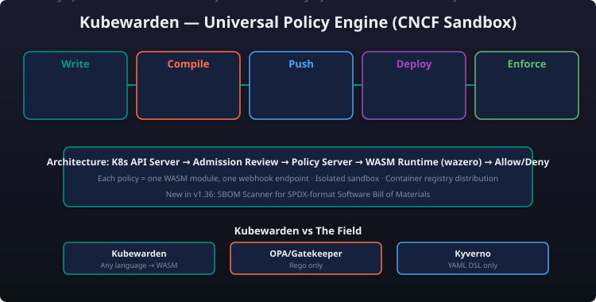
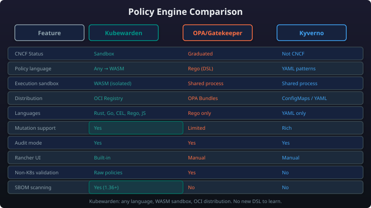

# Module 8: Policy as Code — Kubewarden

!!! abstract "Module Overview"
    **Kubewarden** is a CNCF Sandbox project that reimagines Kubernetes admission control through **WebAssembly (WASM)** — enabling policies written in any programming language, distributed via container registries, and executed in a sandboxed runtime. It is the policy-as-code engine in the SUSE Cloud Native security stack, complementary to [NeuVector](module-04-neuvector.md) runtime security and integrated into [Rancher Prime](module-03-rancher-prime.md).

---

## What Is Kubewarden?

Kubewarden is a **universal policy engine for Kubernetes** that uses WebAssembly (WASM) as its policy execution runtime. It processes admission requests through the Kubernetes `ValidatingWebhookConfiguration` and `MutatingWebhookConfiguration` mechanisms, evaluating policies written as WASM modules.

> "Kubewarden is not 'yet another policy engine' — it is a **fundamentally different approach** to policy as code. Instead of forcing you into a single DSL (like Rego for OPA, or YAML patterns for Kyverno), Kubewarden lets you write policies in **any language that compiles to WebAssembly** — Rust, Go, CEL, Rego, JavaScript, Swift, and more. The WASM module is the policy."

| Property | Kubewarden | OPA/Gatekeeper | Kyverno |
|---|---|---|---|
| **CNCF Status** | **Sandbox** | **Graduated** (OPA) | Not in CNCF |
| **Policy language** | Any language → WASM | Rego (DSL) | YAML-based DSL |
| **Distribution** | **Container registry** (OCI artifact) | OPA bundles (JSON/Rego) | YAML manifests |
| **Execution sandbox** | :white_check_mark: **WASM sandbox** | :warning: Rego evaluator (no sandbox) | :warning: Native Go execution |
| **Runtime performance** | Fast (native WASM execution) | Moderate (Rego evaluation) | Fast (native Go) |
| **Policy isolation** | :white_check_mark: Per-policy sandbox | :x: All policies in same OPA process | :x: All policies in same webhook |
| **Language flexibility** | **Any language** | Rego only | YAML patterns only |
| **Audit mode** | :white_check_mark: | :white_check_mark: | :white_check_mark: |
| **Mutation support** | :white_check_mark: | :white_check_mark: (limited) | :white_check_mark: (rich) |
| **Context-aware (cluster state)** | :white_check_mark: (via `kubewarden-context-aware`) | :white_check_mark: (via OPA data) | :white_check_mark: (native) |
| **Built-in Rancher UI** | :white_check_mark: | :x: Manual | :x: Manual |
| **Marketplace / catalog** | :white_check_mark: Kubewarden Hub | :white_check_mark: OPA Bundles | :white_check_mark: Kyverno Policies |
| **SBOM scanning (new)** | :white_check_mark: (v1.36+) | :x: | :x: |

!!! note "Why This Matters"
    The ability to write policies in **any language** means your existing development team can contribute policies without learning Rego or a new DSL. A Rust developer writes Rust → WASM. A Go developer writes Go → WASM. A platform engineer writes CEL expressions directly. The same CI/CD pipeline that builds your applications can build and test your policies.

### Why It's Different

| Traditional Policy Engine | Kubewarden |
|---|---|
| Policy is written in a **proprietary DSL** (Rego for OPA, YAML patterns for Kyverno) | Policy is written in **any language** that compiles to WASM |
| Policy execution happens in a **shared runtime** (all policies share one process) | Each policy runs in its **own WASM sandbox** — no cross-policy interference |
| Policy distribution is **file-based** (OPA bundles, YAML files) | Policy distribution is **registry-based** (OCI artifacts — same as container images) |
| Policy execution is **not sandboxed** — a buggy policy can crash the evaluator | Policy execution is **fully sandboxed** — a panic in one policy cannot affect others |
| Adding a new language requires extending the engine | Adding a new language requires only a WASM compiler target |

---

## How It Works



The Kubewarden policy lifecycle follows a simple pipeline with four stages:

1. **Write** — A policy author writes a policy using a supported language (Rust, Go, CEL, Rego, JavaScript, Swift)
2. **Compile** — The source code is compiled to a `.wasm` binary
3. **Distribute** — The WASM module is pushed to an OCI-compliant container registry (Docker Hub, Harbor, GHCR, Quay) as an OCI artifact — the same way you push container images
4. **Deploy** — A `ClusterAdmissionPolicy` or `AdmissionPolicy` CRD references the registry URI; the Policy Server pulls the WASM module and instantiates it in a sandbox
5. **Enforce** — Kubernetes admission requests are forwarded to the Policy Server, which evaluates the policy and returns `allow` or `deny`

A `ClusterAdmissionPolicy` resource references a WASM module from an OCI registry (e.g., `ghcr.io/kubewarden/policies/host-network-psp:v0.1.11`) and defines the Kubernetes API resources and operations it evaluates, along with any policy-specific settings.

---

## Supported Languages

Kubewarden's language support is a core differentiator. Any language with a WASM compiler target can be used:

| Language | Status | Best For |
|---|---|---|
| **Rust** | :white_check_mark: **GA (recommended)** | Performance-critical policies, type-safe development, rich SDK (`kubewarden-policy-sdk-rust`) |
| **Go** | :white_check_mark: **GA** | Teams already using Go for operators/controllers; `tinygo` compiler produces WASM modules |
| **CEL** | :white_check_mark: **GA** | Simple, declarative policies; no compilation needed (CEL expressions are compiled to WASM internally) |
| **Rego** | :white_check_mark: **GA** | Teams migrating from OPA/Gatekeeper — write Rego, compile to WASM, run on Kubewarden |
| **JavaScript** | :white_check_mark: **Beta** | Node.js teams; JavaScript policy logic compiled via QuickJS WASM runtime |
| **Swift** | :white_check_mark: **Experimental** | Apple ecosystem developers; SwiftWasm compiler |
| **TinyGo** | :white_check_mark: **GA** | Minimal WASM binary size; fastest compilation path for Go policies |

```rust
// Example: A simple Kubewarden policy in Rust
use kubewarden_policy_sdk::*;

#[no_mangle]
pub extern "C" fn validate(payload: *mut u8, payload_size: u32) -> u64 {
    let request: ValidationRequest = from_bytes(payload, payload_size).unwrap();

    // Extract the pod from the admission request
    let pod: Pod = serde_json::from_value(request.request.object).unwrap();

    // Policy logic: deny privileged containers
    if pod.spec.containers.iter().any(|c| c.security_context.privileged == Some(true)) {
        return reject("Privileged containers are not allowed".to_string());
    }

    accept()
}
```

```cel
# Example: Same policy in CEL (Common Expression Language)
# Compiled to WASM and run in Kubewarden
cel_expr: >
  !object.spec.containers.exists(c,
    has(c.securityContext) &&
    has(c.securityContext.privileged) &&
    c.securityContext.privileged == true
  )
message: "Privileged containers are not allowed"
```

```rego
# Example: Same policy in Rego (compiled to WASM for Kubewarden)
package kubewarden

import future.keywords.if
import future.keywords.in

policy_name := "deny-privileged"

result := {
  "allowed": not is_privileged,
  "message": "Privileged containers are not allowed"
} if {
  is_privileged := any_privileged(input.request.object.spec.containers)
}

any_privileged(containers) = true if {
  some c in containers
  c.security_context.privileged == true
}
```

---

## Architecture

Kubewarden's architecture consists of four main components:

| Component | Role |
|---|---|
| **Policy Server** | A Kubernetes Deployment that loads and executes WASM policies; each policy runs in its own sandbox; the server handles admission requests and returns policy decisions |
| **WASM Runtime (wazero)** | Pure Go WebAssembly runtime — no CGo, no LLVM, no JIT; runs policies in a secure sandbox with memory isolation, CPU limits, and syscall filtering |
| **Admission Webhook** | Standard Kubernetes `ValidatingWebhookConfiguration` and `MutatingWebhookConfiguration` that forwards admission requests to the Policy Server |
| **CRDs** | Kubernetes custom resources that define policies, their scope (cluster vs namespace), settings, and policy server configuration |

### CRDs in Detail

A cluster-scoped `ClusterAdmissionPolicy` like `deny-privileged` applies across all namespaces. It references the policy's OCI image, defines the API groups and resources it targets, and can enable background audit mode with `backgroundAudit: true` to log violations without blocking.

A namespace-scoped `AdmissionPolicy` like `require-labels` affects only the specified namespace. It enforces that created or updated pods carry required labels such as `app.kubernetes.io/name` and `app.kubernetes.io/version`.

A `PolicyServer` custom resource configures the Policy Server deployment, including the container image, replica count, environment variables (e.g., log level), and resource limits for CPU and memory.

---

## Key Features

### Audit Mode (Background Audit)

Kubewarden supports **audit mode** via the `backgroundAudit: true` flag on policies. In audit mode:

- Policies evaluate **existing resources** in the cluster, not just new requests
- Violations are logged and reported but **not blocked**
- Useful for testing new policies before enforcing them
- Audit results are visible in the Kubewarden dashboard and Rancher Prime UI

### Policy Groups

Policy groups allow **combining multiple policies** into a single evaluation:

- `ClusterAdmissionPolicyGroup` — group of policies evaluated together
- Use when multiple conditions must be checked before allowing a resource
- Reduces webhook call overhead — one admission request evaluates all policies in the group
- Supports logical operators (AND, OR) across policy results

### Policy Server Autoscaling

The Policy Server Deployment can be **auto-scaled** based on admission request volume:

- Use `HorizontalPodAutoscaler` based on CPU/memory or custom metrics
- Each Policy Server instance handles multiple policies in separate WASM sandboxes
- Stateless — new replicas pull policies from the same OCI registry

### OCI-Based Distribution

All Kubewarden policies are **OCI artifacts** — they live in container registries alongside your application images:

- Same authentication (Docker Hub, Harbor, GHCR, ECR, ACR)
- Same RBAC (registry-level access control)
- Same supply chain signing (cosign signatures on WASM modules)
- Same mirroring for air-gapped deployments

Use `kwctl push` to upload a compiled WASM policy to an OCI registry, `kwctl annotate` to add metadata like descriptions and URLs, and `kwctl pull` / `kwctl inspect` to retrieve and examine policies from the registry.

### SBOM Scanner (New in v1.36)

!!! note "New Feature — Kubewarden 1.36+"
    Kubewarden v1.36 introduces a built-in **SBOM (Software Bill of Materials) Scanner** that analyses WASM policy modules for known vulnerabilities:

- **Automatic scanning** — Every policy pulled from an OCI registry is scanned for CVEs in its WASM dependencies
- **Policy-level SBOM** — Generates SPDX-format SBOM for each WASM module
- **Integration with NeuVector** — SBOM results can be forwarded to [NeuVector](module-04-neuvector.md) for centralised vulnerability management
- **Admission integration** — Block policy deployment if the WASM module contains critical CVEs
- **Audit log** — SBOM scan results visible in the Kubewarden dashboard and Rancher Prime UI

SBOM scanning is enabled via environment variables on the `PolicyServer` resource — `KUBEWARDEN_SBOM_ENABLED: "true"` activates scanning, and `KUBEWARDEN_SBOM_BLOCK_CRITICAL: "true"` prevents deployment of policies with critical CVEs.

---

## Integration with Rancher Prime

Kubewarden is a **first-class citizen** in [Rancher Prime](module-03-rancher-prime.md):

### One-Click Deployment

- Kubewarden appears in the Rancher Prime Apps & Marketplace catalog
- Deploy to any managed or imported cluster with a single click
- Pre-configured with default Policy Server settings

### Policy Management in Rancher UI

- **Policy catalog** — Browse Kubewarden Hub policies from the Rancher UI
- **Policy creation** — Create `ClusterAdmissionPolicy` and `AdmissionPolicy` CRDs through the UI
- **Audit results** — View policy violations per-namespace and per-cluster
- **Policy status** — See which policies are active, their health, and their evaluation stats

### Fleet Integration

Kubewarden policies can be deployed via [Fleet](module-07-storage-gitops.md) GitOps across multiple clusters:

A Fleet `Bundle` resource targets all production clusters (via `clusterSelector`) and deploys multiple `ClusterAdmissionPolicy` resources — such as `deny-privileged` and `require-resource-limits` — ensuring consistent policy enforcement across the fleet.

### RBAC Integration

Kubewarden policies respect Rancher Prime's RBAC model:

- **Project-scoped policies** — Namespace-scoped `AdmissionPolicy` within a Rancher project
- **Cluster-scoped policies** — `ClusterAdmissionPolicy` applied cluster-wide by cluster admins
- **Audit-only permissions** — Operators can view policy violations without the ability to modify policies

---

## Complementary Security: Kubewarden + NeuVector

Kubewarden and [NeuVector](module-04-neuvector.md) serve **complementary roles** in the SUSE Cloud Native security stack:

| Security Layer | Kubewarden | NeuVector |
|---|---|---|
| **Admission control** | :white_check_mark: **Native** — evaluate and block resource creation/modification | :white_check_mark: Admission control based on image vulnerability severity |
| **Runtime security** | :x: Admission only (not runtime) | :white_check_mark: **Native** — eBPF-based runtime monitoring, process/file/network |
| **Policy as code** | :white_check_mark: **Native** — WASM-based, any language | :x: Not policy-as-code (rule-based) |
| **Image scanning** | :white_check_mark: SBOM scanning of WASM policies (v1.36+) | :white_check_mark: Full container image CVE scanning |
| **Network security** | :x: Not applicable | :white_check_mark: WAF, DLP, network micro-segmentation |
| **Compliance auditing** | :white_check_mark: Policy violation audit logs | :white_check_mark: CIS, NIST, PCI, HIPAA, GDPR |
| **Supply chain security** | :white_check_mark: OCI registry + cosign for policies | :white_check_mark: Image signing verification, SBOM generation |

The SUSE Cloud Native Security Stack operates at two layers: **Admission (pre-deployment)** where Kubewarden enforces WASM policies (deny privileged containers, require resource limits, enforce namespace labels) and NeuVector performs image scanning to block critical CVEs on admission; and **Runtime (post-deployment)** where NeuVector provides eBPF-based process monitoring, file system protection, and network segmentation.

!!! tip "The Complete Security Story"
    **Kubewarden blocks bad configurations before they reach the cluster; NeuVector detects and prevents attacks that happen at runtime.** For example: Kubewarden prevents a deployment from running as root (admission), while NeuVector detects and blocks a container that unexpectedly starts a reverse shell (runtime). Together, they provide defence-in-depth from CI/CD through production.

---

## Kubewarden vs OPA/Gatekeeper vs Kyverno — Comparison Table



| Dimension | Kubewarden | OPA/Gatekeeper | Kyverno |
|---|---|---|---|
| **CNCF Status** | :warning: Sandbox | :white_check_mark: Graduated (OPA) | :x: Not in CNCF |
| **Policy Language** | Any → WASM (Rust, Go, CEL, Rego, JS, Swift) | Rego (DSL) | YAML patterns (DSL) |
| **Execution Model** | Sandboxed WASM per policy | Single Rego evaluator | Native Go |
| **Policy Distribution** | OCI Registry (container-native) | OPA Bundles (files/HTTP) | YAML manifests |
| **Multi-Language Support** | :white_check_mark: **Excellent** | :x: Rego only | :x: YAML only |
| **Sandbox Isolation** | :white_check_mark: **Full** (WASM sandbox) | :x: Shared process | :x: Shared process |
| **Mutation Support** | :white_check_mark: Full | :warning: Limited (Gatekeeper) | :white_check_mark: **Rich** |
| **Generate Resources** | :x: Not supported | :x: Not supported | :white_check_mark: **Native** |
| **Context-Aware** | :white_check_mark: Via `kubewarden-context-aware` | :white_check_mark: OPA data | :white_check_mark: Native |
| **Audit Mode** | :white_check_mark: | :white_check_mark: | :white_check_mark: |
| **Built-in Policies Catalog** | :white_check_mark: **Kubewarden Hub** | :white_check_mark: OPA Bundles | :white_check_mark: Kyverno Policies |
| **Rancher Prime UI** | :white_check_mark: **Native** | :x: Manual | :x: Manual |
| **SBOM Scanning** | :white_check_mark: (v1.36+) | :x: | :x: |
| **Performance** | Fast (native WASM) | Moderate (Rego EVAL) | Fast (native Go) |
| **Learning Curve** | Medium (any language) | High (must learn Rego) | Low (YAML patterns) |
| **Enterprise Support** | SUSE Prime subscription | Vendors (Styra, others) | Vendors (Nirmata) |

| Dimension | Best Choice |
|---|---|
| **Best for Rancher Prime users** | **Kubewarden** — native UI, one-click deploy, Fleet integration |
| **Best for multi-language teams** | **Kubewarden** — Rust, Go, CEL, Rego, JS, Swift |
| **Best for simple YAML-based policies** | **Kyverno** — lowest barrier to entry |
| **Best for OPA/Rego investment** | **Gatekeeper** — existing Rego knowledge re-usable |
| **Best for sandboxed security** | **Kubewarden** — only fully sandboxed WASM execution |
| **Best for generate/cleanup resources** | **Kyverno** — unique generate/cleanup capabilities |

---

## Deployment Options

### Basic Deployment

Kubewarden can be installed using Helm by adding the Kubewarden chart repository and installing the `kubewarden-crds`, `kubewarden-controller`, and `kubewarden-defaults` charts in the `kubewarden-system` namespace, with options to configure Policy Server replica count and resource limits.

### Rancher Prime Deployment

Deploy Kubewarden directly from the Rancher Prime UI:

1. Navigate to **Apps & Marketplace** → **Charts**
2. Search for "Kubewarden"
3. Click **Install**
4. Configure Policy Server replica count and resource limits
5. Click **Launch**

---

## The "Why Kubewarden" Positioning Script

> **Positioning Kubewarden:**
> *"Your customer asks: 'We've already adopted OPA/Gatekeeper — we wrote 50 Rego policies. Why would we move to Kubewarden?'*
> *
> *Here's the honest answer: If you're deep in Rego and it works for you, OPA is a fine choice. But ask yourself: who on your team can write and maintain Rego? Now ask who can write Go, or Rust, or CEL, or JavaScript.*
> *
> *Kubewarden doesn't force you to learn a DSL. You write policies in the languages your team already knows — Rust, Go, CEL, Rego, JavaScript, Swift — compile them to WASM, and distribute them through your existing container registry alongside your application images.*
> *
> *And because each policy runs in its own WASM sandbox, a buggy or malicious policy cannot crash the policy server or affect other policies. That's not just theoretical security — it's operational safety that no other admission controller provides.*
> *
> *When you combine Kubewarden with NeuVector for runtime security, you get a complete guardrail system: Kubewarden blocks bad configurations before they reach the cluster, NeuVector detects attacks that happen at runtime. That's defence-in-depth from a single vendor — SUSE."*

---

## Cross-References

| Module | Topic | Link |
|:-------|:------|:------|
| [Module 1: Strategy & Platform Overview](module-01-strategy.md) | Where Kubewarden fits in the security stack | Policy as code in the integrated SUSE platform |
| [Module 2: K8s Distributions](module-02-k8s-distributions.md) | The clusters Kubewarden protects | RKE2 and K3s admission policies |
| [Module 3: Rancher Prime](module-03-rancher-prime.md) | The platform Kubewarden integrates with | One-click deploy, native RBAC, Rancher UI policy management |
| [Module 4: NeuVector](module-04-neuvector.md) | Complementary runtime security | Kubewarden blocks bad configs; NeuVector stops runtime attacks |
| [Module 5: Harvester](module-05-harvester.md) | Policy enforcement for VM workloads | Kubewarden policies for Harvester virtual machines |
| [Module 6: Edge Computing](module-06-edge.md) | Policy as code at the edge | Lightweight Kubewarden policies for K3s clusters in remote sites |
| [Module 7: Storage & GitOps](module-07-storage-gitops.md) | Deploying Kubewarden policies via Fleet GitOps | Policy-as-code delivered across clusters with Fleet bundles |
| [Module 9: Ecosystem & Competitive](module-09-ecosystem-competitive.md) | Kubewarden vs. OPA/Gatekeeper vs. Kyverno | Competitive policy engine positioning |
| [Module 10: Sales Scenarios by Vertical](module-10-sales-scenarios.md) | Applying Kubewarden in a customer conversation | PSD2/GDPR/PCI compliance policies for financial services |
| [Module 11: MultiLinux Management](module-11-multilinux.md) | Policy enforcement across multi-Linux distributions | Unified policy as code for heterogeneous Linux environments |
| [Quick Reference Card](quick-reference.md) | Cheat sheet | Key numbers, product URLs, CLI commands |
