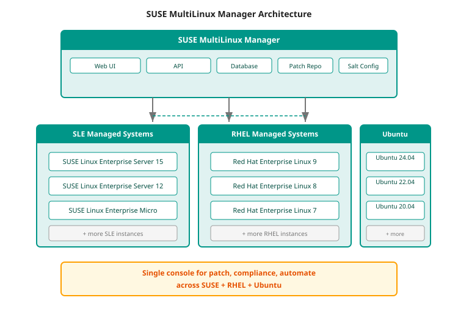

# Module 11: MultiLinux Management

!!! info "Module Purpose"
    Understand SUSE's MultiLinux Manager and MultiLinux Support offerings — how SUSE helps enterprises manage heterogeneous Linux environments across distributions, and why this matters in customer conversations where existing Red Hat Enterprise Linux or Ubuntu deployments need to coexist with SUSE.

---

## The MultiLinux Challenge

Most enterprise customers do not run a single Linux distribution. The reality is:

| Environment | Typical Distribution | Why It's There |
|:------------|:---------------------|:---------------|
| Legacy data center | Red Hat Enterprise Linux | Long-standing RHEL deployment, often for SAP or Oracle |
| Cloud workloads | Ubuntu, Amazon Linux | Cloud-provider preferred images, developer preference |
| Kubernetes nodes | SLE Micro, RHEL CoreOS | OS-optimized for container workloads |
| Edge devices | SLE Micro, Ubuntu Core | Minimal footprint, immutable updates |
| SAP infrastructure | SUSE Linux Enterprise Server | SAP's #1 certified Linux platform for 20+ years |

This heterogeneity creates operational challenges:

- **Multiple management consoles** — Different tools for RHEL, SLE, and Ubuntu
- **Inconsistent security patching** — Different patch cadences and vulnerability workflows per distro
- **Compliance fragmentation** — Auditing across multiple OS platforms with different compliance frameworks
- **Skills overhead** — IT teams must maintain expertise across multiple Linux distributions
- **Licensing complexity** — Multiple vendor relationships, renewal cycles, and support tiers

!!! quote "The MultiLinux Pitch"
    > "We know most customers don't run SUSE-only environments. The question isn't 'will you standardize on SUSE?' — it's 'how do you manage the Linux you already have, while adding SUSE for the workloads that need it?'
    >
    > SUSE MultiLinux Support lets you consolidate support for Red Hat Enterprise Linux, Ubuntu, and SUSE Linux Enterprise under a single contract. One vendor, one SLA, one support portal, one team to escalate to.
    >
    > And SUSE MultiLinux Manager gives you a single console for patch management, compliance scanning, and lifecycle automation across all your Linux distributions — whether they're SUSE, Red Hat, or Ubuntu."

---

## SUSE MultiLinux Support

### What It Is

SUSE MultiLinux Support is an enterprise support offering that extends SUSE's enterprise-grade support to **Red Hat Enterprise Linux** and **Ubuntu** workloads — allowing customers to consolidate their Linux support under a single vendor.

| Feature | Details |
|:--------|:---------|
| **Supported Distros** | Red Hat Enterprise Linux 8.x, 9.x; Ubuntu 20.04 LTS, 22.04 LTS, 24.04 LTS |
| **Support Level** | SUSE Enterprise Support (24x7 available) with SLA-backed response times |
| **Scope** | OS-level support, security patching, bug fixes, lifecycle management |
| **Migration Path** | Support for existing RHEL or Ubuntu installations while planning migration to SUSE Linux Enterprise |
| **Portal** | Single SUSE Customer Center portal for all supported systems |
| **Pricing** | Per-server subscription, competitive with Red Hat and Canonical enterprise pricing |

### Why Customers Choose It

| Customer Situation | Why MultiLinux Support Wins |
|:-------------------|:----------------------------|
| **RHEL shop testing SUSE** | Run SUSE alongside existing RHEL with a single support contract — no need to maintain separate Red Hat support while evaluating |
| **Post-Broadcom VMware migration** | Moving VMs from vSphere to Harvester; consolidate Linux support across RHEL (legacy) and SLE (new) under one vendor |
| **M&A integration** | Two companies, two Linux standards; MultiLinux Support provides a unified support umbrella during the consolidation period |
| **Multi-distro SAP landscape** | SAP runs on both RHEL and SLE; one support contract covers the entire SAP infrastructure |

!!! quote "MultiLinux Support — Positioning Script"
    > "Your customer says: 'We're a Red Hat shop. We don't have SUSE Linux.'
    >
    > **Here's the opportunity:** 'I understand. And we don't need you to rip out your RHEL deployment to work with SUSE. SUSE MultiLinux Support lets us support your existing RHEL and Ubuntu systems under a single contract — with the same SLA, same portal, and same support team as your SUSE systems.
    >
    > This gives you the flexibility to introduce SUSE Linux Enterprise for new workloads — SAP on Kubernetes, edge computing, AI/ML — while your existing RHEL deployment continues running on familiar ground. One support contract, one vendor relationship, no forced migration.'"

---

## SUSE MultiLinux Manager

### What It Is

SUSE MultiLinux Manager (based on SUSE Manager) is an enterprise Linux lifecycle management platform that provides **unified patch management, configuration management, compliance auditing, and automated deployment** across SUSE Linux Enterprise, Red Hat Enterprise Linux, and Ubuntu systems.

| Capability | Description | Benefit |
|:-----------|:------------|:--------|
| **Unified patch management** | Apply security patches and updates across SUSE, RHEL, and Ubuntu from a single console | Eliminates the need for separate Red Hat Satellite or Ubuntu Landscape instances |
| **Compliance scanning** | Automated CIS benchmarks, DISA STIG, and custom compliance profiles across all managed systems | Single compliance dashboard for heterogeneous environments |
| **Configuration management** | Salt-based configuration management for consistent system state across distributions | Automate OS configuration enforcement at scale |
| **Lifecycle management** | Define patch baselines, staged rollouts, and maintenance windows | Predictable, approved update cadence |
| **Content staging** | Download updates once, distribute to air-gapped environments | Essential for disconnected/classified networks |
| **System grouping** | Organize systems by function, location, or compliance profile | Fine-grained control over update policies |

### Architecture at a Glance

### Competitive Comparison

| Dimension | SUSE MultiLinux Manager | Red Hat Satellite | Canonical Landscape |
|:----------|:------------------------|:------------------|:-------------------|
| **Managed distros** | SUSE + RHEL + Ubuntu | RHEL only | Ubuntu only |
| **Configuration engine** | Salt (mature, scalable) | Ansible (add-on) | Puppet (legacy) |
| **Air-gapped support** | Native (content staging) | Native | Limited |
| **Compliance profiles** | CIS, DISA STIG, custom CIS, custom | CIS, custom | Limited |
| **SAP workload awareness** | Native (SLE for SAP integration) | Not available | Not available |
| **Kubernetes node management** | SLE Micro + RKE2/K3s lifecycle | RHEL CoreOS only | Ubuntu + MicroK8s |
| **Edge device support** | SLE Micro, Elemental, Salt | RHEL for Edge | Ubuntu Core |

!!! quote "MultiLinux Manager — Positioning Script"
    > "Your customer says: 'We already use Red Hat Satellite to manage our Linux estate.'
    >
    > **Here's the differentiator:** 'Red Hat Satellite manages RHEL — and only RHEL. If you have a mixed Linux environment — and most enterprises do — you're running separate management tools for each distribution. SUSE MultiLinux Manager handles SUSE, Red Hat, AND Ubuntu from a single console.
    >
    > That means one patch management workflow, one compliance dashboard, one configuration management engine (Salt) that works across all three distributions. For SAP shops, it understands SLE for SAP and can manage the entire SAP infrastructure — Linux, K8s, security — from one place.'"

---

## MultiLinux in the SUSE Portfolio Context

MultiLinux capabilities are not standalone islands — they integrate directly with the broader SUSE portfolio:

| Integration | How It Works | Why It Matters |
|:------------|:-------------|:---------------|
| **Rancher Prime** | MultiLinux Manager manages OS nodes; Rancher Prime manages K8s clusters on those nodes | Full-stack management from OS to orchestration |
| **SUSE Edge** | Elemental for edge OS lifecycle + MultiLinux Manager for data center systems | Unified OS management across core and edge |
| **NeuVector** | MultiLinux Manager handles OS patching; NeuVector handles container security | Complementary security coverage |
| **SAP landscape** | MultiLinux Manager manages SLE for SAP; Rancher Prime manages SAP K8s | Single-vendor SAP infrastructure management |

---

## Positioning Summary

| Customer Situation | MultiLinux Angle | Products to Lead With |
|:-------------------|:-----------------|:----------------------|
| **"We're a Red Hat shop"** | SUSE MultiLinux Support covers RHEL under a single contract | MultiLinux Support + SLE + Rancher Prime |
| **"We have mixed Linux"** | Manage all distros from one console with MultiLinux Manager | MultiLinux Manager + Salt |
| **"We're migrating from VMware"** | Consolidate Linux support across legacy and new environments | MultiLinux Support + Harvester + Rancher Prime |
| **"We need air-gapped lifecycle"** | Content staging for all three distros from one manager | MultiLinux Manager + Harbor |
| **"SAP on multiple Linux distros"** | One support contract for RHEL and SLE SAP systems | MultiLinux Support + SLE for SAP |

---

## Cross-Links to All Modules

| Module | Topic | Connection to MultiLinux |
|:-------|:------|:------------------------|
| [Module 1: Strategy & Platform Overview](module-01-strategy.md) | SUSE portfolio architecture | MultiLinux fits as the "any Linux" management layer |
| [Module 2: K8s Distributions](module-02-k8s-distributions.md) | RKE2 & K3s | K8s nodes running SLE Micro, managed by MultiLinux Manager |
| [Module 3: Rancher Prime](module-03-rancher-prime.md) | Multi-cluster management | Rancher Prime manages K8s; MultiLinux manages the underlying OS |
| [Module 4: NeuVector](module-04-neuvector.md) | Container security | OS patching (MultiLinux) + container security (NeuVector) = layered defence |
| [Module 5: Harvester](module-05-harvester.md) | VM virtualization | Harvester nodes managed by MultiLinux Manager for OS lifecycle |
| [Module 6: Edge Computing](module-06-edge.md) | SUSE Edge | MultiLinux Manager for data center; Elemental for edge (complementary) |
| [Module 7: Storage & GitOps](module-07-storage-gitops.md) | Longhorn + Fleet | Longhorn storage nodes benefit from MultiLinux patch management |
| [Module 8: Kubewarden](module-08-kubewarden.md) | Policy as Code | OS-level policies via MultiLinux + K8s-level policies via Kubewarden |
| [Module 9: Ecosystem & Competitive](module-09-ecosystem-competitive.md) | Competitive positioning | MultiLinux vs. Red Hat Satellite, vs. Canonical Landscape |
| [Module 10: Sales Scenarios](module-10-sales-scenarios.md) | Vertical scenarios | MultiLinux appears in every vertical where heterogeneous Linux exists |
| [Quick Reference Card](quick-reference.md) | Cheat sheet | Key numbers, product URLs, comparison matrices |

---

## Summary

| Topic | Key Takeaway |
|:------|:-------------|
| **MultiLinux Support** | One support contract for SUSE, RHEL, and Ubuntu — reduces vendor count, simplifies procurement |
| **MultiLinux Manager** | One management console for all three distributions — patch, configure, comply, automate |
| **Integration** | Works alongside Rancher Prime, NeuVector, Harvester, and SUSE Edge for full-stack management |
| **Sales trigger** | "We're a Red Hat shop" is NOT a blocker — it's an opening for MultiLinux Support |
| **The real value** | Reducing the operational overhead of multi-distro Linux management |

!!! tip "Next Step"
    Review the **[Quick Reference Card](quick-reference.md)** for a portfolio-wide view, or practice vertical scenarios in **[Module 10: Sales Scenarios](module-10-sales-scenarios.md)**.

---

*Prepared for the SUSE Portfolio Positioning Exercise. Module 11 — MultiLinux Management. June 2026.*