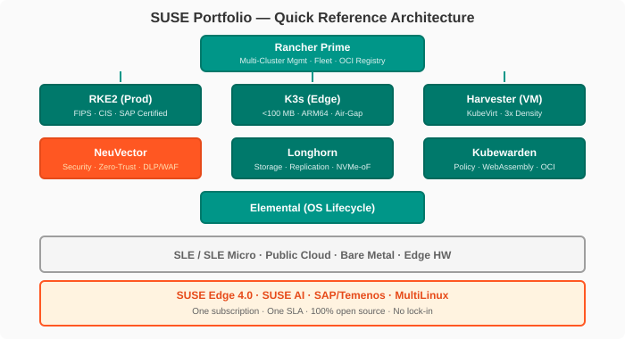

# Quick Reference Card

> A pocket-ready reference for the SUSE portfolio. Use this card during study sessions and as a quick-reference during customer conversations.

---

## Product → Customer Need Matrix

Use this table to map a **customer pain point** directly to a **SUSE product**. In conversations, starting with the need — not the product — earns credibility.

| Customer Need / Pain Point | Primary SUSE Solution | Supporting Components | Module |
|:---------------------------|:----------------------|:----------------------|:------:|
| "We need a secure, compliant K8s for production" | **RKE2** (CIS-hardened, FIPS, SLE BCI) | Rancher Prime, NeuVector, OCI Prime Registry | [2](module-02-k8s-distributions.md) |
| "Our clusters at the edge need a lightweight K8s" | **K3s** (<100 MB, ARM64, offline) | Elemental, SUSE Edge, Fleeet | [2](module-02-k8s-distributions.md), [6](module-06-edge.md) |
| "Managing 50+ clusters across clouds is chaos" | **Rancher Prime** (multi-cluster mgmt) | Fleet (GitOps), OCI Prime Registry, Cluster API | [3](module-03-rancher-prime.md) |
| "Container security keeps our compliance team up at night" | **NeuVector** (zero-trust, DLP, WAF, runtime) | Kubewarden (policy), OCI registry scanning | [4](module-04-neuvector.md) |
| "vSphere licensing costs are out of control at the edge" | **Harvester** (VM on K8s, KubeVirt + Longhorn) | Elemental, Rancher Prime (management) | [5](module-05-harvester.md) |
| "We need consistent K8s from factory floor to data center" | **SUSE Edge** (3 variants: Edge/Industrial/Telco) | Elemental, K3s, Rancher Prime, Longhorn | [6](module-06-edge.md) |
| "Our stateful apps need reliable persistent storage on K8s" | **Longhorn** (distributed block storage) | Rancher Prime Backup, Velero | [7](module-07-storage-gitops.md) |
| "GitOps across 100 clusters without a management nightmare" | **Fleet** (multi-cluster GitOps engine) | Rancher Prime, Git repos, OCI artifacts | [7](module-07-storage-gitops.md) |
| "We need context-aware, lightweight policy enforcement" | **Kubewarden** (WebAssembly policies) | NeuVector (runtime), Policy Hub (250+ policies) | [8](module-08-kubewarden.md) |
| "Our Linux fleet is a mix of SUSE, RHEL, and Ubuntu — management is fragmented" | **SUSE Multi-Linux Manager** (patch mgmt, compliance, automation) | Salt automation, CIS benchmarks, RBAC | [9](module-09-ecosystem-competitive.md) |
| "We want to cut RHEL support costs without losing enterprise support" | **SUSE Multi-Linux Support** (single support for any Linux) | Unified SLA, L3 engineering, migration tools | [9](module-09-ecosystem-competitive.md) |
| "Our SAP workloads need a certified, stable platform" | **SUSE Linux Enterprise + Rancher Prime** | SAP-certified K8s, Temenos Core validated | [9](module-09-ecosystem-competitive.md) |
| "We need AI/ML infrastructure without vendor lock-in" | **SUSE AI** + **Rancher Prime** | GPU scheduling, Kubewarden for AI governance | [9](module-09-ecosystem-competitive.md) |
| "OCI supply chain security and compliance" | **OCI Prime Registry** (SLSA L3, SBOM) | Rancher Prime, NeuVector (scanning) | [3](module-03-rancher-prime.md) |
| "VM sprawl at remote sites with no local IT" | **Harvester + Elemental** (VM + OS lifecycle) | Rancher Prime (central mgmt), Longhorn (storage) | [5](module-05-harvester.md), [6](module-06-edge.md) |

---

## Competitive Comparison Matrix

!!! tip "The 'Why SUSE?' Answer"

    Every SUSE product competes against an incumbent. The table below shows how SUSE stacks up against **Red Hat (OpenShift)**, **VMware (Tanzu/vSphere)**, and **DIY (vanilla K8s + community tools)** across the dimensions that matter most to enterprise buyers.

| Dimension | :material-cloud-check: **SUSE / Rancher Prime** | :material-redhat: **Red Hat OpenShift** | :material-vmware: **VMware Tanzu / vSphere** | :material-wrench: **DIY (Vanilla K8s)** |
|:----------|:-----------------------------------------------|:----------------------------------------|:---------------------------------------------|:----------------------------------------|
| **Licensing** | Per-core subscription, portable, no cluster limits | Per-core, expensive RAM-based pricing | Per-core or per-VM, vSphere tax | Free + operational cost |
| **Open Source** | 100% upstream — RKE2/K3s/NeuVector/Harvester/Longhorn/Kubewarden all open source | Downstream OKD, but RHEL CoreOS is proprietary | Minimal — mostly proprietary | 100% open source |
| **K8s Distribution** | RKE2 (hardened, FIPS) + K3s (lightweight) — choice | OpenShift (only one K8s) | Tanzu (TKG — wraps upstream) | Whatever you choose (kubeadm, KIND, etc.) |
| **Security** | NeuVector (zero-trust, DLP, WAF, runtime) — **only K8s-native full-stack** | Advanced Cluster Security (spun-off, extra cost) | NSX-based (network-centric, not container-native) | Up to you — manual integration |
| **Edge** | K3s <100 MB + Elemental + 3 SUSE Edge variants | MicroShift (limited), OpenShift on RHEL for Edge | VMware Edge (heavy, requires vSphere) | Whatever you build |
| **VM Capabilities** | Harvester — native VM on K8s (KubeVirt + Longhorn) | OpenShift Virtualization (KubeVirt-based) | vSphere (mature but separate) — Tanzu VMs are add-on | Roll your own KubeVirt |
| **GitOps** | Fleet (native, multi-cluster, built into Rancher) | Argo CD (add-on, not native) | Add-on only | Argo CD / Flux |
| **Policy** | Kubewarden (WebAssembly, context-aware) — native | Gatekeeper (OPA) add-on | OPAL/OPA — add-on | Gatekeeper / Kyverno |
| **Storage** | Longhorn (distributed, open source, K8s-native) | OpenShift Data Foundation (Ceph, complex) | vSAN (proprietary, expensive) | Rook/Ceph, OpenEBS |
| **SAP Validation** | **Certified** — SLE + Rancher Prime | Supported, not primary | Not validated | Not validated |
| **SLSA Level** | **L3** (OCI Prime Registry) | Undisclosed | N/A | N/A |
| **Release Cadence** | 4-month predictable cycles | ~6-month cycles | 12–18 month cycles | When you decide |
| **Support Model** | Single vendor — SUSE (enterprise SLA) | Red Hat | VMware | Multi-vendor or community |
| **Management** | Rancher Prime — cluster + apps + security + policies (single pane) | OpenShift Console + ACM (Acquires.io) | Tanzu Mission Control + Aria | Kubernetes Dashboard + custom tooling |
| **TCO** | **30–50% lower** than VMware per IDC | Moderate | Highest ($12K+/core/yr) | Lowest (but highest ops burden) |

!!! warning "Key Competitive Narrative"

    **SUSE's killer combination:** The only vendor that delivers **Rancher Prime (management) + K3s (lightweight) + NeuVector (security) + Kubewarden (policy) + Harvester (VM)** as a **single, integrated, open-source, enterprise-supported platform** — without the lock-in of Red Hat or the cost of VMware.

---

## Key Numbers to Remember

| Number | What It Means | Why It Matters in the Exercise |
|:------:|:--------------|:-------------------------------|
| **15,000+** | Teams using Rancher | Credibility — "the most adopted enterprise K8s management platform" |
| **$3.4M** | Avg annual benefit (IDC) | ROI conversation starter |
| **<100 MB** | K3s binary size | Edge / IoT / resource-constrained environments |
| **1M+** | K3s active clusters | Community proof point |
| **5 years** | Max LTS duration | Enterprise compliance, regulated industries |
| **4 months** | Release cadence | Innovation pace + predictability |
| **L3** | SLSA level (Rancher Prime Registry) | Supply-chain security differentiator |
| **250+** | Kubewarden policy catalog | Policy-as-code adoption velocity |
| **30,000+** | Longhorn deployments | Storage reliability proof |
| **5,000+** | Max clusters per Fleet controller | GitOps at scale |
| **3x** | Harvester VM density vs. vSphere | Virtualization TCO argument |
| **3** | Edge deployment variants | Market coverage breadth |
| **20+ years** | SAP on SUSE Linux | Enterprise trust, validated stacks |
| **15,000+** | NeuVector CVEs detected (2024) | Security threat reality |

---

## Product URLs & Reference Links

### Core Products

| Product | Documentation | GitHub | Other |
|:--------|:--------------|:-------|:------|
| Rancher Prime | [docs.rancher.com](https://docs.rancher.com) | [github.com/rancher/rancher](https://github.com/rancher/rancher) | [suse.com/products/rancher](https://www.suse.com/products/rancher) |
| RKE2 | [docs.rke2.io](https://docs.rke2.io) | [github.com/rancher/rke2](https://github.com/rancher/rke2) | CIS benchmarks included |
| K3s | [docs.k3s.io](https://docs.k3s.io) | [github.com/k3s-io/k3s](https://github.com/k3s-io/k3s) | [k3s.io](https://k3s.io) |
| NeuVector | [docs.neuvector.com](https://docs.neuvector.com) | [github.com/neuvector/neuvector](https://github.com/neuvector/neuvector) | [neuvector.com](https://neuvector.com) |
| Harvester | [docs.harvesterhci.io](https://docs.harvesterhci.io) | [github.com/harvester/harvester](https://github.com/harvester/harvester) | [harvesterhci.io](https://harvesterhci.io) |
| Longhorn | [longhorn.io/docs](https://longhorn.io/docs) | [github.com/longhorn/longhorn](https://github.com/longhorn/longhorn) | [longhorn.io](https://longhorn.io) |
| Kubewarden | [kubewarden.io](https://www.kubewarden.io) | [github.com/kubewarden](https://github.com/kubewarden) | WebAssembly-based |
| Fleet | [fleet.rancher.io](https://fleet.rancher.io) | [github.com/rancher/fleet](https://github.com/rancher/fleet) | GitOps engine |
| Elemental | [elemental.docs.rancher.com](https://elemental.docs.rancher.com) | [github.com/rancher/elemental](https://github.com/rancher/elemental) | OS lifecycle management |
| OCI Prime Registry | [registry.rancher.com](https://registry.rancher.com) | — | SLSA L3, SBOM |

### Strategic

| Product / Initiative | URL | Relevance |
|:---------------------|:----|:----------|
| SUSE Edge | [suse.com/products/suse-edge](https://www.suse.com/products/suse-edge) | Edge/Industrial/Telco variants |
| SUSE AI | [suse.com/products/suse-ai](https://www.suse.com/products/suse-ai) | Enterprise AI on open infrastructure |
| SUSE Linux Enterprise 16 | [suse.com/products/suse-linux-enterprise](https://www.suse.com/products/suse-linux-enterprise) | Next-gen SLE (preview at SUSECON 2025) |
| SUSE Security | [suse.com/security](https://www.suse.com/security) | Zero-trust + compliance |
| IDC Business Value Study | [suse.com/rancher-idc](https://www.suse.com/rancher-idc) | $3.4M avg benefit |
|| SUSE MultiLinux Support | [https://www.suse.com/products/multilinux-support](https://www.suse.com/products/multilinux-support) | Unified support for any Linux |
|| SUSE Customer Portal | [scc.suse.com](https://scc.suse.com) | Trials, licenses, support |

---

## Quick Reference Architecture Diagram

---

## Quick Quiz — Test Yourself

!!! info "Self-Check Questions"

    Cover the answers with your hand and see if you can respond to each:

    1. **Q:** A customer says "I need K8s for my factory floor with no internet." Which SUSE product?  
       **A:** K3s (offline-capable, <100 MB) + Elemental (OS management) — see [Module 2](module-02-k8s-distributions.md) and [Module 6](module-06-edge.md).
    
    2. **Q:** "How is SUSE different from Red Hat OpenShift?"  
       **A:** SUSE gives you **choice** (RKE2 or K3s), **native security** (NeuVector, not spun-off), **native GitOps** (Fleet), **native policy** (Kubewarden), **native VM** (Harvester) — all open source. See [Module 9](module-09-ecosystem-competitive.md).
    
    3. **Q:** "We're paying too much for VMware. What do you have?"  
       **A:** Harvester replaces vSphere at the edge with 3x VM density, Longhorn replaces vSAN, and Rancher Prime replaces vCenter. TCO 30-50% lower. See [Module 5](module-05-harvester.md) and [Module 9](module-09-ecosystem-competitive.md).
    
    4. **Q:** "Will you be around in 5 years?"  
       **A:** SUSE is 30+ years old, publicly traded, #1 on SAP Linux, with $3.4M avg customer benefit validated by IDC. See [Module 1](module-01-strategy.md).

    5. **Q:** "What security do you have for containers?"  
       **A:** NeuVector — the only K8s-native platform covering zero-trust, DLP, WAF, runtime scanning, AI/ML model security. Add Kubewarden for policy-as-code. See [Module 4](module-04-neuvector.md) and [Module 8](module-08-kubewarden.md).

---

## Navigation

| Page | Description |
|:-----|:------------|
| [Home](index.md) | Landing page, study paths, key facts |
| [Module 1: Strategy & Platform Overview](module-01-strategy.md) | SUSE strategy, vision, portfolio architecture |
| [Module 2: K8s Distributions](module-02-k8s-distributions.md) | RKE2, K3s in depth |
| [Module 3: Rancher Prime](module-03-rancher-prime.md) | Multi-cluster management, Fleet, OCI Registry |
| [Module 4: NeuVector](module-04-neuvector.md) | Container security, zero-trust, DLP, WAF |
| [Module 5: Harvester](module-05-harvester.md) | VM platform on K8s |
| [Module 6: Edge Computing](module-06-edge.md) | SUSE Edge 3 variants |
| [Module 7: Storage & GitOps](module-07-storage-gitops.md) | Longhorn, Fleet, Backup |
| [Module 8: Kubewarden](module-08-kubewarden.md) | WebAssembly policy engine |
| [Module 9: Ecosystem & Competitive](module-09-ecosystem-competitive.md) | Competitive positioning, partnerships |
|| [Module 10: Sales Scenarios by Vertical](module-10-sales-scenarios.md) | Customer conversation practice |
|| [Module 11: MultiLinux Management](module-11-multilinux.md) | MultiLinux Manager & Support |

---

*SUSE Portfolio Quick Reference Card — SUSECON 2025 Edition. June 2026.*
